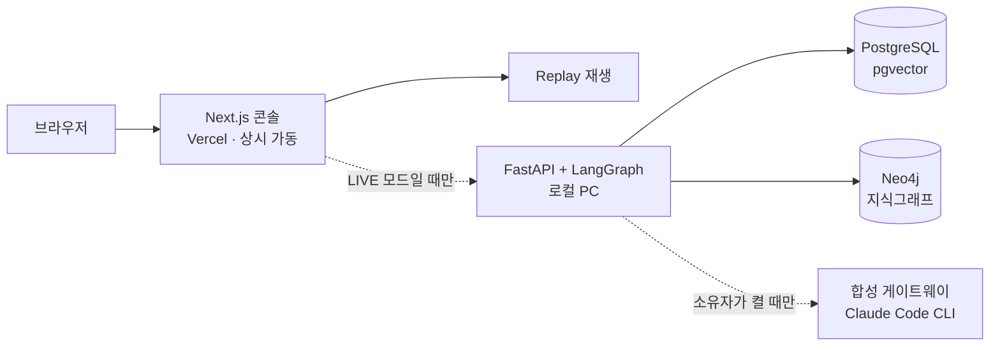

# Factory Knowledge Twin

공장 설비에 이상이 생기면 담당자는 센서 기록, 점검 절차서, 그리고 베테랑의 머릿속에만 있는 관계 지식을 따로따로 뒤져야 하고, 그동안 설비는 멈춰 있습니다.

이 프로젝트는 그 세 가지를 하나로 묶어 두고, AI가 정해진 절차대로 조사한 뒤 원문 인용과 그래프 경로가 붙은 원인 후보와 작업지시 초안을 내놓는 운영 콘솔입니다. 초안까지가 AI의 일이고, 승인은 사람이 합니다.

포트폴리오용 PoC입니다. 데이터는 전부 합성(synthetic)이고, 실제 공장이나 설비와 연결되어 있지 않습니다.

## 화면에서 벌어지는 일

1. 공장 전경에서 진동 알람이 뜬 CNC 설비를 클릭합니다.
2. 3주간 완만히 오르다 최근 하루 급등한 진동 그래프를 확인합니다.
3. "AI 조사"를 누르면 에이전트가 수치 조회 → 문서 검색 → 관계 추적을 단계별로 진행합니다. 과정이 화면에 그대로 흐릅니다.
4. 원인 후보(예: 베어링 마모)마다 매뉴얼 원문 인용과 설비→고장→절차→안전규정 경로가 붙어 나옵니다.
5. AI가 만든 작업지시 초안(안전 잠금 절차 포함)을 사람이 고치고 승인하거나 반려합니다.
6. 리셋 버튼을 누르면 조사 이력과 작업지시가 지워지고 처음 화면으로 돌아갑니다. 방문자마다 독립된 공간을 쓰기 때문에 다른 사람의 체험에 영향을 주지 않습니다.

로컬 AI 엔진이 꺼져 있어도 데모는 돕니다. 미리 기록한 조사 과정을 재생하는 REPLAY 모드가 기본이고, 엔진이 켜지면 같은 화면이 LIVE 모드로 바뀝니다. 어느 모드인지는 화면 배지에 항상 표시됩니다.

## 구조



데이터의 정본은 PostgreSQL 하나이고, 벡터 색인과 그래프는 거기서 다시 만들 수 있는 파생물입니다. 조사 절차는 LangGraph 상태 기계로 돌아갑니다. 계획, 수치 조회, 문서 검색, 그래프 추적, 종합, 작업지시 초안, 사람의 판단 순서이고 단계마다 이벤트가 남아서 나중에 그대로 재생할 수 있습니다. 검색은 벡터, 하이브리드, 그래프 세 방식을 나란히 놓고 비교할 수 있습니다.

답할 근거가 없으면 "근거 없음"이라고 답합니다. 그럴듯한 요약으로 빈칸을 메우지 않습니다.

LLM 합성은 켜고 끌 수 있는 부가 기능입니다. 소유자 PC의 Claude Code CLI(구독)를 감싼 로컬 게이트웨이가 떠 있을 때만 붙고, 응답이 조사 근거 밖을 인용하면 그 응답은 통째로 버립니다. 구독이 공개 API로 나가는 일은 없습니다. Live 조사는 세션당 시간당 3회, 서비스 전체로도 시간당 3회까지이고, 재생은 횟수 제한이 없습니다. 실시간 분석이 잠시 불가하면 배지가 재생 모드로 바뀌고 다시 열리는 시각을 함께 보여 줍니다.

## 기술 스택

| 계층 | 기술 |
|---|---|
| 프론트엔드 | Next.js (Vercel) |
| 백엔드 | Python FastAPI · WebSocket |
| AI 워크플로우 | LangGraph |
| 검색 | pgvector · 하이브리드 · GraphRAG |
| 지식그래프 | Neo4j |
| 데이터 | PostgreSQL |
| 임베딩 | 로컬 모델 `intfloat/multilingual-e5-small` (처음 받을 때만 네트워크 필요) |

## 실행

새 클론에서 한 줄로 세웁니다.

```powershell
pwsh infra/bootstrap.ps1 -ProjectName fkt-<이름>
```

Docker 스택 기동 → 마이그레이션 → 합성 데이터 시드 → 벡터 색인 → 그래프 투영을 순서대로 돌리고, 끝에 health와 청크·노드 수를 검산합니다. 2026-09-04에 새 클론 한 대에서 완주를 확인했습니다(약 4분). 다른 환경에서도 되는지는 아직 재보지 않았습니다.

각 단계의 명령·옵션·주의사항은 [runbook §4](docs/deployment/runbook.md)에 있습니다.

전제 조건은 리포가 선언한 값 그대로입니다(CI가 이 표를 리포 실물과 대조합니다).

| 무엇 | 값 | 출처 |
|---|---|---|
| Docker | compose 스택 `pgvector/pgvector:pg16` · `neo4j:5-community` | `docker-compose.yml` |
| pnpm | **10.32.1** | `apps/web-console/package.json` |
| Node | **20**(ci) · **22**(security 감사) | `.github/workflows/ci.yml` · `.github/workflows/security.yml` (단일 선언 없음) |
| Python | CI는 3.12, 새 클론 실측은 3.14 | 단일 선언 없음 |

bootstrap이 돌리는 여섯 단계의 정본 명령입니다. 5·6단은 venv를 먼저 만들어야 하고, 5단은 `PGPORT`를 꼭 지정해야 합니다(안 주면 다른 스택을 색인합니다).

<!-- excerpt:runbook-4 -->
| # | 정본 명령 | 정본 |
|---|---|---|
| 1 | `docker compose up -d` | [runbook §4-1](docs/deployment/runbook.md) |
| 2 | `$env:COMPOSE_PROJECT_NAME='<project>'` | [runbook §4-1a](docs/deployment/runbook.md) |
| 3 | `pwsh services/ai-api/db/migrate.ps1` | [runbook §4-1](docs/deployment/runbook.md) |
| 4 | `pwsh data/seed.ps1` | [runbook §4-1](docs/deployment/runbook.md) |
| 5 | `services\indexer\.venv\Scripts\python.exe services\indexer\build_index.py` | [runbook §4-1](docs/deployment/runbook.md) |
| 6 | `services\projector\.venv\Scripts\python.exe services\projector\build_projection.py` | [runbook §4-1](docs/deployment/runbook.md) |
<!-- /excerpt:runbook-4 -->

## 디자인 · 접근성

다크 기본, 시스템 글꼴, 390~1440px 반응형. 대비 미달 0, 터치 대상 44px, 강제 색 모드와 `prefers-reduced-motion` 대응, 키보드만으로 가이드 투어 완주까지 확인했습니다. Chromium·WebKit·Firefox 에뮬레이션에서 오류 0. 실기기와 실사용자 검증은 아직 없습니다.

첫 방문에는 게임 튜토리얼처럼 한 걸음씩 짚어 주는 가이드 투어가 뜹니다. 언제든 "?"로 다시 열 수 있고, `?intro=1&tour=1`로 바로 열 수도 있습니다.

## 어디까지 검증했나

계획 정본은 [test-plan-v1.md](docs/plan/test-plan-v1.md)입니다. 초록만 세지 않고, 일부러 깨뜨려 빨강을 봤는지를 함께 기록합니다.

| 축 | 결과 (2026-09-04) |
|---|---|
| 골든 시나리오 | 10/10 완주 · 런타임 오류 0 |
| API 계약 | 74/74 |
| E2E (Playwright) | 135 passed · 3 failed(무대 부재) · 4 skipped |
| 예외 상황 25건 | 23 PASS · 2 미검증 |

**2026-09-11 갱신** — E2E 의 「3 failed(무대 부재)」는 전용 스텁 무대에서 «무대 조건»으로 확정했습니다(대상 결함 0 · [evidence/e2e-stub-stage.md](evidence/e2e-stub-stage.md)). API 계약 케이스는 계약 v0.2.5 기준 99건이며 CI 가 매 PR 에 돌립니다. Gate 7(보안·오남용 13항)은 부분 판정 2건을 정적 감사·구조적 면역으로 닫아 종결했습니다([evidence/t5-2-gate7-close.md](evidence/t5-2-gate7-close.md)). 승격 26~32 는 각각 공개면 외부 재검 PASS 를 남겼습니다(`evidence/promo{26..32}-external-recheck.md`).

구현 좌석의 초록은 완료가 아닙니다. 검증 좌석이 독립 무대에서 다시 잰 뒤에만 완료로 칩니다.

**벤치마크 · 지연** — 정본 = [benchmarks/eval-report-final.md](benchmarks/eval-report-final.md)(raw 재집계 · Target 은 계획서에 수치가 없어 「첫 기준선」 · LLM judge 0 · 전부 합성 데이터 위의 PoC 관측치).

| 축 | Actual | 분모 |
|---|---|---|
| 검색 Recall@5(any) | vector 4 · hybrid 18 · graphrag 6 | 기대 근거가 있는 26문 |
| SOP 검색 정확도 | vector 0 · hybrid 5 · graphrag 6 | 11문 |
| 답변 본문의 설비 id 호명 | 0/25(근거 발췌에는 25/25) | 같은 앵커 1문 · 25 run |
| 안전 규정 누락(D-84 뒤) | 0/22 | v0.4 이후 22 run |
| 합성 지연 중앙값 | 14.1초(잠정 목표 10초 미달) | wallMs 있는 24 run |
| 실 CLI 안전 규정 재요청 발생률 | 1/7 | 전용 무대 · 7 run · 원인 미측 |

못 잰 축은 0 으로 적지 않고 이름으로 남겼습니다(Hold Precision · Cross-consistency · Work Order Completeness 분모 0 · 39문 답변 불성립 · 지표 4·7 실재 재현). 40문 일반화가 아니라 앵커 1문의 반복 측정입니다.

## 알려진 제약

- 공개 셸(Vercel 경로)에서는 조사 실행의 WebSocket 스트림이 열리지 않습니다. 2초 간격 조회로 같은 화면을 만들고, 그 사실을 화면에 띄웁니다. 층은 갈랐습니다 — 같은 쿠키·같은 run 으로 Vercel 경유만 닫히고 터널 직결은 열립니다([evidence/d21-ws-layer-split.md](evidence/d21-ws-layer-split.md)). 그 안의 어느 홉인지는 재지 않았습니다.
- 오프라인 머신에서 임베딩 모델 다운로드 없이 세울 수 있는지는 재보지 않았습니다.
- 라이브 데모 링크는 이 문서에 싣지 않습니다.

## 안전 경계

- 모든 데이터는 합성 데이터입니다. 실제 회사·고객·설비 정보가 없습니다.
- 실제 설비를 제어하지 않습니다. 작업지시와 승인은 샌드박스 안의 시뮬레이션입니다.
- Claude 구독을 공개 API로 노출하지 않습니다.
- 라이선스는 Apache-2.0 입니다. 화면 빌드가 끌어오는 sharp 의 libvips 바이너리(LGPL-3.0-or-later)는 동적 링크 · 미수정 상태로 포함되며 `NOTICE`·`THIRD_PARTY_NOTICES.md` 에 명기합니다(운영자 결정 2026-09-06).

## 현재 상태

**완료(2026-09-11)** — 티켓 원장 68/68, 열린 결함 0. 마지막 승격 = 32(main `c35377d` · 공개면 외부 재검 [evidence/promo32-external-recheck.md](evidence/promo32-external-recheck.md)). Gate 1~8 판정 = [evidence/t5-5-gate-verdict.md](evidence/t5-5-gate-verdict.md)(축소 적용 v0.3) + Gate 7 종결 [evidence/t5-2-gate7-close.md](evidence/t5-2-gate7-close.md). 결정 = [docs/decisions/004](docs/decisions/004-release-gate-verdict.md). 진행 원장 = [docs/plan/ticket-ledger.md](docs/plan/ticket-ledger.md). 이후는 신규 기능 없이 결함 착신 시 수리만 합니다.

## License

[Apache-2.0](LICENSE)
