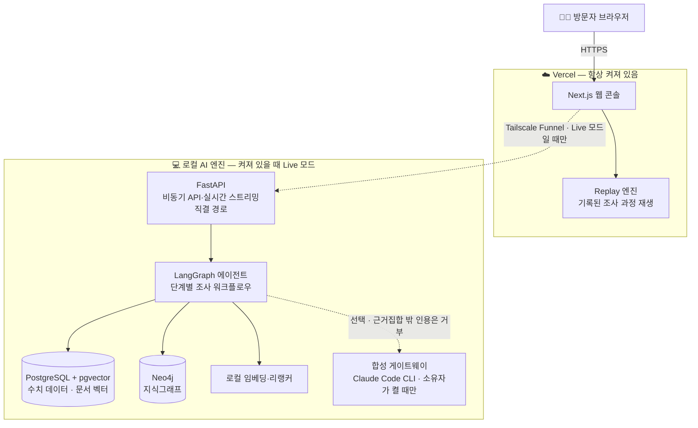
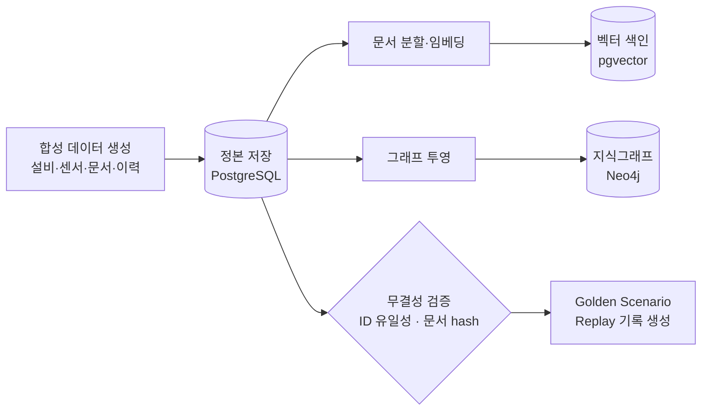
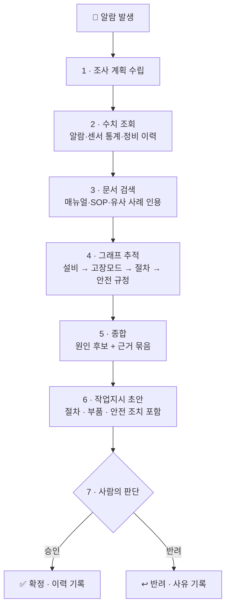

# Factory Knowledge Twin — AI Operations Console

> **공장 설비에 이상이 생겼을 때, AI가 흩어진 지식을 한 번에 조사해 «근거가 붙은» 원인 후보와 조치안을 만들어 주는 운영 콘솔입니다.**
> 판단과 승인은 언제나 사람이 합니다 — AI는 초안까지만 만듭니다.

*When factory equipment misbehaves, an AI agent investigates sensor data, documents, and a knowledge graph — then returns root-cause candidates with cited evidence and drafts a work order for human approval.*

---

## 🏭 어떤 문제를 풀려고 하나요?

공장에서 설비 이상이 발생하면, 담당자는 **세 종류의 흩어진 지식**을 뒤져야 합니다.

| | 어디에 있나 | 무엇이 문제인가 |
|---|---|---|
| 📊 **수치 데이터** | 센서 추세·알람·정비 기록 (모니터링 시스템) | 숫자만으로는 «왜»를 모른다 |
| 📄 **문서** | 점검 절차서(SOP)·설비 매뉴얼·안전 규정 (문서함) | 어디 몇 페이지에 있는지 찾기 어렵다 |
| 🕸 **관계 지식** | 「이 설비 모델은 어떤 고장이 잦고, 그 고장엔 어떤 절차·규정이 따르는가」 | 대부분 **베테랑의 머릿속**에만 있다 |

세 곳을 오가며 답을 조립하는 동안 **설비는 멈춰 있습니다**. 그렇다고 AI에게 물어도, 근거 없는 요약이면 현장은 믿지 않습니다.

**이 시스템의 답**: 세 지식을 하나로 연결해 두고, AI가 그 위를 **절차대로 조사**하게 한 뒤, 모든 결론에 **원문 인용과 관계 경로를 증거로 첨부**합니다.

| 현장의 문제 | 이 시스템에서는 |
|---|---|
| ⏱ 원인 파악이 늦어 설비 정지가 길어진다 | 근거가 붙은 원인 후보를 **수 분 안에** 제시 |
| 🗂 지식이 흩어져 신입은 못 찾는다 | 조직 지식 전체가 **질문 가능한 형태**로 연결 |
| 🤖 AI의 답을 믿기 어렵다 | 모든 후보에 **문서 원문 + 그래프 경로** 첨부 — 믿으라가 아니라 «확인하라» |
| ⚠️ 조치할 때 안전 규정을 빠뜨린다 | 작업지시 초안에 안전 규정이 **구조적으로 결합** (삭제 불가) |

---

## 🎬 화면에서 이렇게 보입니다 — 3분 시나리오

1. **공장 전경** — 라인·설비 상태가 한눈에. CNC 밀링 설비 하나에 진동 알람이 떠 있습니다.
2. **알람 클릭** — 3주간 완만히 오르다 최근 24시간 급등한 진동 그래프가 보입니다.
3. **AI 조사 시작** — 에이전트가 조사 계획을 세우고 DB 조회 → 문서 검색 → 관계 추적을 **단계별로** 진행합니다. 과정이 전부 화면에 흐릅니다 — 블랙박스가 아닙니다. 진행 표시는 **직결 경로에서 실시간 스트림(WebSocket)**, **공개 셸에서는 주기 조회**입니다 — 주기 조회는 **진행 중인 조사에 한해** 돕니다(아래 「알려진 제약」).
4. **근거 확인** — 원인 후보 «베어링 마모(유력)»·«공구 불균형». 각 후보에 그래프 경로 시각화와 매뉴얼 원문 인용(문장 강조)이 붙어 있습니다. 검색 방식 3가지(벡터/하이브리드/그래프)의 결과 차이도 비교해 볼 수 있습니다.
5. **작업지시 승인** — AI가 만든 점검·교체 초안(안전 잠금 절차 포함)을 사람이 고치고 **승인 또는 반려**합니다.
6. **리셋** — 원클릭으로 처음부터. 방문자마다 독립된 체험 공간이 주어집니다.

> 💡 **노트북이 꺼져 있어도 데모는 돕니다** — 미리 기록된 조사 과정을 그대로 재생(replay)하는 상시 가동 REPLAY 셸과, 로컬 AI 엔진이 켜졌을 때의 LIVE 모드 **이중 구조**입니다. Live 의 진행 표시는 직결 경로에서 실시간(WebSocket)이고, 공개 셸을 경유하면 주기 조회로 대신합니다.

---

## 🏗 아키텍처



- **REPLAY(기본)**: 클라우드만으로 전체 시나리오 체험 — 항상 동작. 화면 배지가 `◑REPLAY` 로 그 사실을 보여 줍니다.
- **LIVE(옵션)**: 로컬 AI 엔진이 온라인이면 같은 화면이 실제 조사로 전환합니다(진행 표시 = 직결 경로 실시간 스트림 · 공개 셸 주기 조회). 끊기면 자동으로 REPLAY 로 복귀하고, 그 사실이 배지에 남습니다.
- **공개 경로의 실물**: 브라우저 → Vercel(Next.js 셸) → Tailscale Funnel → 소유자 PC 의 FastAPI 컨테이너. 셸의 API 목적지는 **빌드 시점에 굽는 상수**라, 런타임 env 로는 바꿀 수 없고 값이 다르면 부팅이 멈춥니다(같은 화면이 다른 서버를 보는 사고의 재발 방지).

---

## 🧭 처음 오신 분을 위한 가이드 투어

첫 방문 화면에 **「둘러보기」 초대 카드**가 뜹니다. 시작하면 게임 튜토리얼처럼 **한 걸음씩 손잡이를 짚어 주며** 공장 전경 → 알람 → 조사 → 근거 → 승인까지 안내합니다(걸음마다 짚을 자리를 보여 주고, 어떤 걸음은 방문자가 직접 눌러야 넘어갑니다).

- 투어 중에는 **안내 대상 밖의 화면이 눌리지 않습니다**(`inert`). `inert` 를 모르는 브라우저에서는 포인터 가드가 같은 일을 하고, 투어가 끝나면 그 가드는 함께 걷힙니다 — 걷히지 않으면 「모든 클릭이 죽는」 더 큰 회귀라서, 그 축을 검증이 따로 잽니다.
- 언제든 「?」로 다시 열 수 있고, 진행 위치는 보존됩니다. 주소에 `?intro=1&tour=1` 을 붙여 바로 열 수도 있습니다.
- 투어를 끄면 화면은 **한 픽셀도 달라지지 않습니다** — 투어는 화면 위에 얹힌 층이지 화면의 일부가 아닙니다(규격 [`docs/design/t6-5-guided-tour-spec.md`](docs/design/t6-5-guided-tour-spec.md)).

## 🎨 디자인 · 접근성

- **2026-09-03 디자인 개편** — 다크 기본 · 시스템 글꼴 추종 · 반투명 층 · 반응형(390~1440). 규격 = [`docs/design/t6-4-apple-design-spec.md`](docs/design/t6-4-apple-design-spec.md).
- **접근성 실측** — 대비 미달 0 · 터치 대상 44px(위젯 전수 · 터치 포인터에서만 확장) · 강제 색 모드 · `prefers-reduced-motion`/`-transparency` 대응 · 키보드 투어 완주. 판정문 = [`docs/design/t7-1-accessibility-verdict.md`](docs/design/t7-1-accessibility-verdict.md). 🔴 **실기기·실사용자 검증은 0** — 「쓰기 편해졌다」는 주장은 하지 않습니다.
- **브라우저 호환** — Chromium · WebKit · Firefox 헤드리스 에뮬레이션 120칸 오류 0. 실기기는 안 쟀습니다.

## 🧯 화면이 «조용히» 무너지지 않게 — 폴백 계층

폴백은 침묵하기 쉽습니다. 이 콘솔은 **대체 동작을 했다는 사실을 화면에 남기는 것**을 판정선으로 삼았습니다.

| 상황 | 화면이 하는 일 | 근거 |
|---|---|---|
| 실시간 스트림이 안 열림(공개 셸) | 주기 조회로 이어가며 「2초마다 다시 묻는 중」 문장을 띄움 | D-21 |
| 서버 혼잡(503 + `Retry-After`) | 배지 「◌혼잡 · N초 뒤 재시도」 · 걷히면 배지도 사라짐 | D-49 |
| 상류가 끊김 | 「서버와 연결이 끊겼습니다. 마지막으로 받은 상태를 보여 드리고 있습니다.」 · 원인 값은 속성에 보존 | D-51 |
| 로컬 엔진이 꺼짐 | 기록된 조사를 정적 재생 · 배지 `◑REPLAY` | 정적 replay |
| Live 합성 인용이 근거 밖 | 합성 전량 거부 + 그 사실 표시 | 합성 가드 |
| 같은 조사를 동시에 두 번 요청 | 하나만 만들고 재사용을 헤더로 알림(`X-FKT-Run-Reused`) | D-48 · 멱등 |

---

## 🔄 데이터 파이프라인

모든 데이터는 **합성(synthetic) 제조 데이터**입니다 — 실제 공장 데이터가 아닙니다.



정본(SSOT)은 한 곳 — 벡터 색인과 그래프는 언제든 **재생성 가능한 파생물**입니다. 문서가 바뀌면 어느 색인이 낡았는지 추적됩니다.

---

## 🤖 AI 조사 워크플로우



- 각 단계는 **이벤트로 기록**되어 직결 경로에서는 실시간 스트리밍되고 공개 셸에서는 주기 조회로 전달되며, 그대로 재생(replay)할 수 있습니다. 어느 경로든 이벤트에 **순번이 붙어 오기 때문에** 중복되거나 빠지지 않습니다.
- 근거가 없는 결론은 내보내지 않습니다. 답할 수 없는 질문에는 **「근거 없음」이 정답**입니다.
- 마지막 단계는 항상 사람입니다 — AI는 어떤 것도 자동 확정하지 않습니다.

### 5단계 종합의 «두 축» — 공급자는 갈아 끼울 수 있습니다

- **결정적 집계**(기본): 앞 세 단계가 모은 근거만으로 원인 후보를 정렬합니다. 외부 모델을 부르지 않으므로 공개 배포에서 **항상 이 축**으로 돕니다.
- **Live AI 합성**(선택): 소유자 PC 의 로컬 게이트웨이가 켜져 있을 때만 붙는 축입니다. 프로세스를 켜고 끄는 것이 곧 ON/OFF 이고, **컨테이너는 재기동하지 않습니다**. 화면 배지가 `LIVE`/`REPLAY` 로 그 사실을 그대로 보여 줍니다 — 조용한 강등은 없습니다.
- 🔴 **공개 API 로 구독이 나가지 않습니다.** 게이트웨이 주소 env 가 없으면 그 축의 코드는 **적재조차 되지 않고**, 그래서 공개 셸의 `online:false` 는 결함이 아니라 **참**입니다.
- **공급자 교체 가능**: 이 축의 계약은 `POST /synthesize` 한 개(`{ranking, rationale, model}`)입니다. 게이트웨이만 갈아 끼우면 다른 모델·다른 공급자를 붙일 수 있고, 응답이 **run 근거집합 밖을 인용하면 전량 거부**되는 가드는 어느 공급자에게나 똑같이 적용됩니다.
- **상한**: 세션 하나가 쓸 수 있는 Live 조사 횟수는 **5회/시간**입니다(공개 배포 설정 `FKT_RUN_CAP_PER_SESSION=5`). 넘기면 `429` 로 거절하되 **녹화 재생은 그대로 열려 있습니다** — 재생은 구독을 쓰지 않습니다. 운영 절차는 [runbook §7](docs/deployment/runbook.md) 을 보세요.

---

## 🧰 기술 스택

| 계층 | 기술 | 역할 |
|---|---|---|
| 프론트엔드 | **Next.js** (Vercel) | 운영 콘솔 UI · 상시 가동 REPLAY 셸 · 가이드 투어 |
| 백엔드 | **Python FastAPI** | 완전 비동기 API · WebSocket 실시간 스트리밍(직결 경로) |
| AI 워크플로우 | **LangGraph** | 상태 기계 기반 조사 절차 · 단계별 감사 기록 |
| 검색 | **pgvector + 하이브리드 + GraphRAG** | 문서 의미 검색 · 3전략 비교 |
| 지식그래프 | **Neo4j** | 설비-고장모드-절차-규정 관계 추적 |
| 데이터 | **PostgreSQL** | 단일 정본(SSOT) · 센서·이력·문서 레지스트리 |
| 임베딩 | **로컬 모델** (`intfloat/multilingual-e5-small`) | 추론에 외부 API 를 부르지 않습니다 — 🔴 단 **모델을 처음 받을 때는 네트워크가 필요**합니다(아래 「실행」) |

---

## ▶ 실행 — 새 클론에서 세우기

**절차의 정본은 [`docs/deployment/runbook.md` §4](docs/deployment/runbook.md)입니다.** 이 README 는
명령을 **복제하지 않습니다** — 아래 발췌는 각 단의 «한 줄»만 옮기고 옵션·검증·주의는 정본에만
둡니다. 같은 명령을 두 곳에 «통째로» 적으면 한쪽이 먼저 낡고, 어느 쪽이 맞는지 읽는 사람이
판단해야 합니다.

### 전제조건 (리포가 선언하거나 실측된 값)

| 무엇 | 값 | 어디서 온 값인가 |
|---|---|---|
| Docker | compose 스택 — `pgvector/pgvector:pg16` · `neo4j:5-community` | `docker-compose.yml` 이 고정한 이미지 태그 |
| pnpm | **10.32.1** | `apps/web-console/package.json` 의 `packageManager` (선언) |
| Node | **22** | CI 가 쓰는 값(`.github/workflows/security.yml`) — 🔴 `engines` 선언은 **없습니다** |
| Python | **3.14** 에서 세운 실측이 있습니다(`services/indexer/README.md` 부수 실측) · 의존성 감사 CI 는 **3.12** 로 돕니다 | 리포에 «단일» 선언이 없어, 두 값을 갈라 적습니다 |

🔴 **버전을 「요구사항」이 아니라 「이 값에서 섰다」로 적습니다.** 다른 조합에서 서는지는
재보지 않았고, 안 잰 것을 요구사항으로 쓰면 그 문장이 처음 틀리는 자리는 남의 머신입니다.

### 1커맨드 (2026-09-04 실측 · [runbook §4-1](docs/deployment/runbook.md))

```powershell
pwsh infra/bootstrap.ps1 -ProjectName fkt-<이름>
```

아래 6단을 한 명령으로 돌리고 끝에 검산 3층(health 두 층 · 벡터 청크 ≥1 · 노드·관계 수)을 냅니다.
🔴 실측은 **1머신 · 새 클론 1회 완주**(rc 0 · 256 초 · 청크 59 · 노드 309 · 관계 448 · 세 스택에서 같은 수)이지
「어디서나 됩니다」가 아닙니다 — 값·조건·안 잰 것은 runbook §4-1 표에 있습니다.

### 순서 (요약 — 각 단계의 명령과 검증은 runbook §4)

| # | 단계 | 비고 |
|---|---|---|
| 1 | `docker compose up -d` | |
| 2 | **`COMPOSE_PROJECT_NAME` 지정** | 🔴 기본 project 가 아니면 필수 — 안 주면 다른 스택을 봅니다(runbook §4-1a) |
| 3 | 스키마 마이그레이션 | `services/ai-api/db/migrate.ps1` · 001~008 |
| 4 | synthetic seed | `data/seed.ps1` |
| 5 | **벡터 색인** | venv 부터 만듭니다 — [`services/indexer/README.md`](services/indexer/README.md) |
| 6 | **그래프 투영** | 같이 venv 부터 — [`services/projector/README.md`](services/projector/README.md) |

🔴 **5·6 은 둘 다 돌아야 합니다.** 서로 다른 파생이라 하나를 빠뜨리면 그 축만 조용히 빕니다 —
투영을 건너뛰면 조사 run 이 `completed` 로 닫히면서 그래프 경로만 0건이 됩니다
([`evidence/t5-5-clean-env.md`](evidence/t5-5-clean-env.md) §4-2·§4-3).

🔴 **5 단계는 네트워크가 필요합니다** — 임베딩 모델을 Hugging Face Hub 에서 내려받습니다.
오프라인 머신에서 이 단이 서는지는 **아직 재보지 않았습니다**(미실측 · 「됩니다」가 아닙니다).
2026-09-04 새 클론 실측도 HF 캐시(488 MB)가 «선재»한 머신이라 이 축은 **여전히 안 재졌습니다**(캐시 적중 ≠ 네트워크 없이 됨).

#### 6줄 발췌 — 각 단의 «정본 명령 한 줄»

<!-- excerpt:runbook-4 -->
> 🔴 **clean environment 재실측 «전»이라 이 발췌는 «잠정»입니다** — 재실측은 검증 좌석과 짝으로 돕니다(T5-5 · §35.6).

| # | 정본 명령 (한 줄) | 정본 행 |
|---|---|---|
| 1 | `docker compose up -d` | [runbook §4-1](docs/deployment/runbook.md) |
| 2 | `$env:COMPOSE_PROJECT_NAME='<project>'` | [runbook §4-1a](docs/deployment/runbook.md) |
| 3 | `pwsh services/ai-api/db/migrate.ps1` | [runbook §4-1](docs/deployment/runbook.md) |
| 4 | `pwsh data/seed.ps1` | [runbook §4-1](docs/deployment/runbook.md) |
| 5 | `services\indexer\.venv\Scripts\python.exe services\indexer\build_index.py` | [runbook §4-1 · 「4단이 왜 따로 서 있는가」](docs/deployment/runbook.md) |
| 6 | `services\projector\.venv\Scripts\python.exe services\projector\build_projection.py` | [runbook §4-1 · §4-1b](docs/deployment/runbook.md) |
<!-- /excerpt:runbook-4 -->

🔴 **여섯 줄은 «표지»이지 실행 스크립트가 아닙니다.** 한 단이 한 줄로 끝나지 않습니다 — 5·6 은
**venv 를 먼저 만들고 requirements 를 설치해야** 그 `.venv` 경로가 생기고, 5 는 **`PGPORT` 명시
의무**가 붙습니다(안 주면 실패하지 않고 «다른 스택을 색인»합니다). 그 줄들과 각 단의 검증 명령은
정본 행에 있습니다. 값(project 이름·포트)은 여기서 **자리표시자**로 둡니다 — 남의 머신에서
참이 아닐 값을 README 가 «값»으로 적지 않습니다.

---

## 🛡 안전 경계

- 모든 공장·센서·문서 데이터는 **합성 데이터**입니다. 실제 회사·고객·설비 정보가 없습니다.
- **실제 설비를 제어하지 않습니다.** 작업지시와 승인은 모두 sandbox 안의 시뮬레이션입니다.
- AI 판단은 **사람의 승인 없이 확정되지 않습니다**(human-in-the-loop).
- 공개 서비스는 replay·로컬 모델로 동작하며, **Claude 구독을 공개 API로 노출하지 않습니다**. 진단 근거 문장의 LLM 합성은 **운영자 PC 의 Claude Code CLI(구독)를 감싼 로컬 게이트웨이**에서만 실행되고(Anthropic API 키 없음), 공개 화면은 그 실행 기록본을 재생합니다 — 인용이 조사 근거 밖이면 합성 자체가 거부되고 그 사실이 화면에 표시됩니다.

## ✅ 품질 — 무엇을 어떻게 쟀나

계획 정본 = [`docs/plan/test-plan-v1.md`](docs/plan/test-plan-v1.md)(케이스 60건 · 단위 10 · 통합 12 · 화면 13 · 예외 25). 판정은 두 칸입니다 — **초록**과 **「일부러 깨서 빨강을 봤는가」**. 빨강을 못 본 케이스는 통과가 아니라 «미검증»으로 적습니다.

| 축 | 2026-09-04 값 | 비고 |
|---|---|---|
| 골든 시나리오 | **10/10 완주 · 런타임 오류 0** | 사람처럼 화면 손잡이로만 |
| 계약(API) | **74/74** · 커버리지 56/56 | `packages/contracts` |
| E2E(Playwright) | 135 passed · 3 failed · 4 skipped / 142 | 1440×900 · chromium · 실패 3 = 무대 없음(X 축에서 무대와 함께) |
| 단위 | 8/10 · 빨강 확인 전건 | 구현과 같은 자리(co-location) |
| 예외 25 | **23 PASS · 0 FAIL · 2 미검증** | 멱등 = 「상태가 한 번만 바뀌었다」를 수로 · 폴백 = 「대체 동작이 남았다」 |
| 구현 ≠ 완료 | 구현 좌석의 초록은 **검증 좌석이 독립 무대에서 다시 잰 뒤**에만 완료 | baseline §32.1 |

🔴 **미검증 2 = X-23(합성 무대가 비운 근거를 화면이 그대로 그렸다 — 셸이 상류 응답을 그대로 중계하지 않는 «무대 설계 문제» · 원인 규명 중) · X-13(「근거 없음」 화면을 만들 무대가 없음).** 지우지 않고 남깁니다.

## 📌 현재 상태

**Release 후보 — 축소 적용(v0.3) · 공개 배포 8회차(2026-09-04)**
판정 정본 = [`evidence/t5-5-gate-verdict.md`](evidence/t5-5-gate-verdict.md) §4 (2026-09-02 · 로컬 축) · 결정 = [`docs/decisions/004-release-gate-verdict.md`](docs/decisions/004-release-gate-verdict.md).
🔴 **「축소 적용」은 범위를 줄인 것이지 기준을 낮춘 것이 아닙니다** — 줄인 자리는 그 판정문에
미충족 목록으로 그대로 남아 있습니다. 진행 원장 = [`docs/plan/ticket-ledger.md`](docs/plan/ticket-ledger.md)(50/60).

**측정치 — 성능 수치는 아직 없습니다.**

| 무엇 | 상태 |
|---|---|
| KPI · 지연(P50/P95) | 🔴 **측정 전 — 빈 칸**(baseline §35.2·§35.3) · Live 합성 1건 실측 18~19s(잠정 목표 10s 미달 · 회부) |
| 벤치마크 근거 | 🔴 **미생성** |
| 라이브 데모 링크 | 이 문서에 **싣지 않습니다** — 공개 경계(baseline §15.2)이지 「데모가 없다」는 뜻이 아닙니다 |

🔴 **빈 칸을 숫자로 채우지 않습니다.** 측정 전 수치는 어떤 것도 성능으로 주장하지 않으며,
이 표는 그 자리가 «비어 있다»는 사실 자체를 기록합니다 — 없는 값을 그럴듯한 숫자로 메우면
그 숫자는 지워질 때까지 사실처럼 읽힙니다.

### 알려진 제약

**공개 셸(Vercel 경로)에서 조사 실행의 «실시간 스트림»(WebSocket)이 열리지 않습니다** —
그 경로는 **주기 조회로 대체**해 같은 화면을 만듭니다(D-21 ⓒ 착지 · 계약 v0.1.10).
🔴 **대체가 붙었을 뿐 미개통 자체는 남아 있습니다** — 결함이 해소된 것이 아닙니다.

- **어디서 끊기나** — **공개 셸을 경유하는 구간**에서 끊깁니다. 같은 세션·같은 조사로 그 서버에
  **직접** 붙으면 핸드셰이크는 정상으로 섭니다(즉 서버도 터널도 고장이 아닙니다).
  🔴 **실측이 말하는 것은 여기까지입니다** — 그 구간 «안»의 어느 단계가 끊는지는 **아직 소견**이고
  좁혀서 재지 않았습니다. 구간을 가른 실측 =
  [`evidence/d21-ws-layer-split.md`](evidence/d21-ws-layer-split.md).
- 🔴 **화면은 숨기지 않습니다.** 스트림이 안 열리면 「실시간 스트림 대신 주기 조회로 진행
  중입니다 — 2초마다 서버에 다시 묻습니다」를 그대로 띄웁니다(**진행 중인 조사에 한해서이며**,
  조사가 끝나면 이 줄은 사라집니다). 조용히 메우고 실시간인 척하지 않습니다 — 잃는 것은
  «즉시성»이므로, 화면이 그 사실을 말합니다.
- **서버가 「그만 와라」라고 하면 그 말도 띄웁니다.** 이 조회는 rate limit 제외 목록에 없어서
  (계약 v0.1.10), 운영값과 부딪히면 화면에 **429 로 드러납니다** — 그때는 조회를 멈추고 사유를
  적습니다(운영값 조정은 runbook 축입니다).
- **조사 결과는 잃지 않습니다.** 스트림이 닫히면 셸이 그 자리에서 스냅샷과 이벤트 백로그를 다시
  읽어 화면을 지금 사실까지 올립니다. 이벤트는 **순번을 달고 오기 때문에** 되감아도 중복되거나
  빠지지 않습니다 — 잃는 것은 «즉시성»이지 «사실»이 아닙니다.
- **정적 재생 경로는 영향이 없습니다** — 그 축은 스트림을 쓰지 않습니다.
- **폴링 전환은 착지했습니다**(D-21 ⓒ · 릴리스 뒤 개선 1순위였던 항목). 위 되감기 배관을
  그대로 써서 **서버 변경 0 · 신설 라우트 0**으로 갔고, 클라이언트는 핸드셰이크가 서지 못한
  경우(101 전 close · 1006)에만, 그리고 **조사가 진행 중인 동안에만** `GET /runs/{runId}/events` 를
  2초 간격으로 조회합니다.
  스트림이 서면 이 경로는 **한 번도 돌지 않습니다**(로컬·직결 무변).
  🔴 **이미 실행된 적 있는 조사(warm·replay)는 화면이 열리기도 전에 완주해, 주기 조회가 한 번도
  돌지 않을 수 있습니다** — 주기 조회의 무대는 **수 초 이상 진행되는 조사**입니다(로컬 실측 E1).
  그 경우의 「폴링 0」은 결함이 아니라 「끝난 조사는 두드리지 않는다」가 맞게 돈 것입니다.
  🔴 그리고 이 문서의 「실시간」이라는 **말 자체가 바뀌었으므로 위 문면들을 함께 고쳤습니다** —
  코드만 갈아 끼우고 주장을 두면, 화면은 정직해지는데 문서가 거짓말을 이어받습니다.
  🔴 **남은 것**: 왜 그 구간이 101 을 세우지 못하는지는 여전히 «소견»이고, 좁혀서 재지
  않았습니다. 대체 경로가 붙었다고 그 조사가 끝난 것은 아닙니다.

검증 근거 = [`evidence/t3-6-e2e-verification.md`](evidence/t3-6-e2e-verification.md) ·
[`evidence/d21-ws-layer-split.md`](evidence/d21-ws-layer-split.md) ·
원장 [`docs/plan/ticket-ledger.md`](docs/plan/ticket-ledger.md) D-21.

**재현 절차는 위 「실행」 절에 있습니다.** 이 자리에서 「배포 후 게시하겠다」고 미루던 문장은
지웠습니다 — 절차는 이미 리포 안에 있고, 미루는 문장이 그것을 가리고 있었습니다
([`evidence/t5-5-clean-env.md`](evidence/t5-5-clean-env.md) §1 이 그 상태를 「출발선 부재」로
판정했습니다).

## 📄 License

[Apache-2.0](LICENSE)
