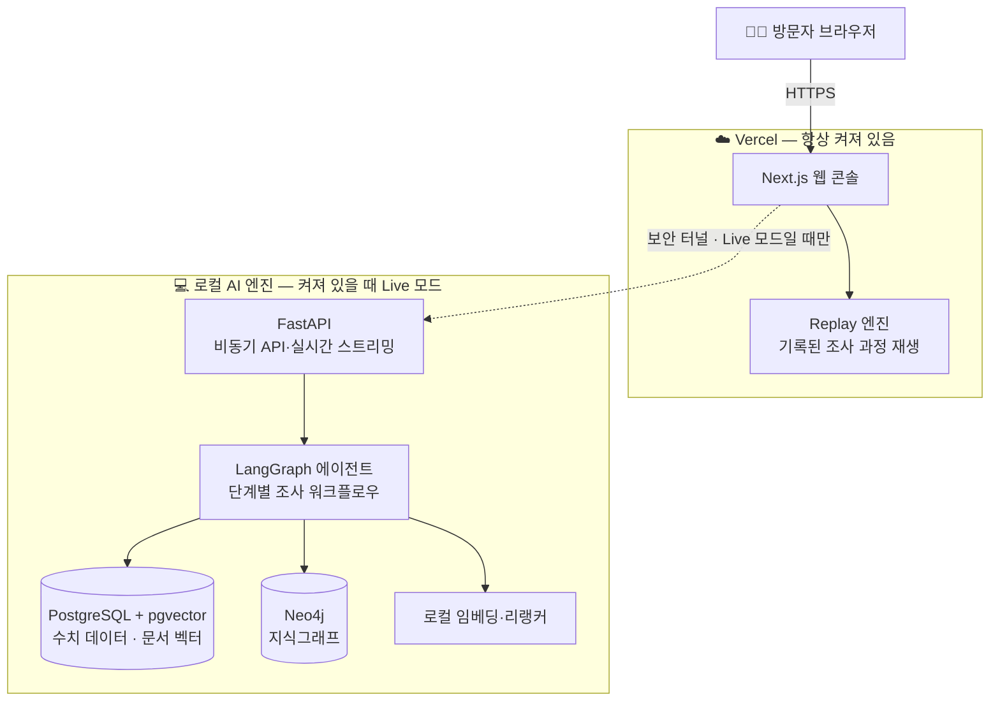
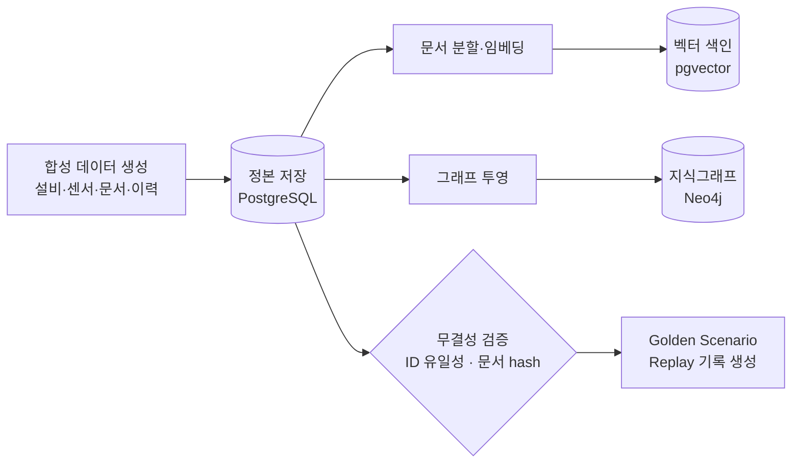
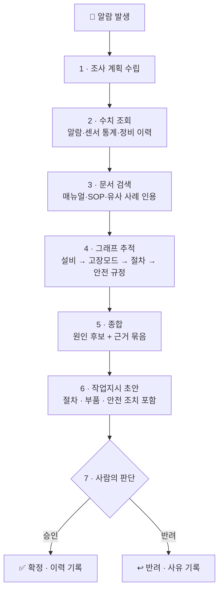

# Factory Knowledge Twin — AI Operations Console

> **공장 설비에 이상이 생겼을 때, AI가 흩어진 지식을 한 번에 조사해 «근거가 붙은» 원인 후보와 조치안을 만들어 주는 운영 콘솔입니다.**
> 판단과 승인은 언제나 사람이 합니다 — AI는 초안까지만 만듭니다.

*When factory equipment misbehaves, an AI agent investigates sensor data, documents, and a knowledge graph — then returns root-cause candidates with cited evidence and drafts a work order for human approval.*

---

## 🏭 어떤 문제를 풀려고 하나요?

공장에서 설비 이상이 발생하면, 담당자는 **세 종류의 흩어진 지식**을 뒤져야 합니다.

| | 어디에 있나 | 무엇이 문제인가 |
|---|---|---|
| 📊 **수치 데이터** | 센서 추세·알람·정비 기록 (모니터링 시스템) | 숫자만으로는 «왜»를 모른다 |
| 📄 **문서** | 점검 절차서(SOP)·설비 매뉴얼·안전 규정 (문서함) | 어디 몇 페이지에 있는지 찾기 어렵다 |
| 🕸 **관계 지식** | 「이 설비 모델은 어떤 고장이 잦고, 그 고장엔 어떤 절차·규정이 따르는가」 | 대부분 **베테랑의 머릿속**에만 있다 |

세 곳을 오가며 답을 조립하는 동안 **설비는 멈춰 있습니다**. 그렇다고 AI에게 물어도, 근거 없는 요약이면 현장은 믿지 않습니다.

**이 시스템의 답**: 세 지식을 하나로 연결해 두고, AI가 그 위를 **절차대로 조사**하게 한 뒤, 모든 결론에 **원문 인용과 관계 경로를 증거로 첨부**합니다.

| 현장의 문제 | 이 시스템에서는 |
|---|---|
| ⏱ 원인 파악이 늦어 설비 정지가 길어진다 | 근거가 붙은 원인 후보를 **수 분 안에** 제시 |
| 🗂 지식이 흩어져 신입은 못 찾는다 | 조직 지식 전체가 **질문 가능한 형태**로 연결 |
| 🤖 AI의 답을 믿기 어렵다 | 모든 후보에 **문서 원문 + 그래프 경로** 첨부 — 믿으라가 아니라 «확인하라» |
| ⚠️ 조치할 때 안전 규정을 빠뜨린다 | 작업지시 초안에 안전 규정이 **구조적으로 결합** (삭제 불가) |

---

## 🎬 화면에서 이렇게 보입니다 — 3분 시나리오

1. **공장 전경** — 라인·설비 상태가 한눈에. CNC 밀링 설비 하나에 진동 알람이 떠 있습니다.
2. **알람 클릭** — 3주간 완만히 오르다 최근 24시간 급등한 진동 그래프가 보입니다.
3. **AI 조사 시작** — 에이전트가 조사 계획을 세우고 DB 조회 → 문서 검색 → 관계 추적을 **단계별로 실시간** 진행합니다. 과정이 전부 화면에 흐릅니다 — 블랙박스가 아닙니다.
4. **근거 확인** — 원인 후보 «베어링 마모(유력)»·«공구 불균형». 각 후보에 그래프 경로 시각화와 매뉴얼 원문 인용(문장 강조)이 붙어 있습니다. 검색 방식 3가지(벡터/하이브리드/그래프)의 결과 차이도 비교해 볼 수 있습니다.
5. **작업지시 승인** — AI가 만든 점검·교체 초안(안전 잠금 절차 포함)을 사람이 고치고 **승인 또는 반려**합니다.
6. **리셋** — 원클릭으로 처음부터. 방문자마다 독립된 체험 공간이 주어집니다.

> 💡 **노트북이 꺼져 있어도 데모는 돕니다** — 미리 기록된 조사 과정을 그대로 재생(replay)하는 상시 가동 Sandbox와, 로컬 AI 엔진이 켜졌을 때의 실시간(Live) 모드 **이중 구조**입니다.

---

## 🏗 아키텍처

- **Sandbox 모드(기본)**: 클라우드만으로 전체 시나리오 체험 — 항상 동작.
- **Live 모드(옵션)**: 로컬 AI 엔진이 온라인이면 같은 화면이 실시간 조사로 전환. 끊기면 자동으로 Replay로 복귀합니다.

---

## 🔄 데이터 파이프라인

모든 데이터는 **합성(synthetic) 제조 데이터**입니다 — 실제 공장 데이터가 아닙니다.

정본(SSOT)은 한 곳 — 벡터 색인과 그래프는 언제든 **재생성 가능한 파생물**입니다. 문서가 바뀌면 어느 색인이 낡았는지 추적됩니다.

---

## 🤖 AI 조사 워크플로우

- 각 단계는 **이벤트로 기록**되어 실시간 스트리밍되고, 그대로 재생(replay)할 수 있습니다.
- 근거가 없는 결론은 내보내지 않습니다. 답할 수 없는 질문에는 **「근거 없음」이 정답**입니다.
- 마지막 단계는 항상 사람입니다 — AI는 어떤 것도 자동 확정하지 않습니다.

---

## 🧰 기술 스택

| 계층 | 기술 | 역할 |
|---|---|---|
| 프론트엔드 | **Next.js** (Vercel) | 운영 콘솔 UI · 상시 가동 Sandbox |
| 백엔드 | **Python FastAPI** | 완전 비동기 API · WebSocket 실시간 스트리밍 |
| AI 워크플로우 | **LangGraph** | 상태 기계 기반 조사 절차 · 단계별 감사 기록 |
| 검색 | **pgvector + 하이브리드 + GraphRAG** | 문서 의미 검색 · 3전략 비교 |
| 지식그래프 | **Neo4j** | 설비-고장모드-절차-규정 관계 추적 |
| 데이터 | **PostgreSQL** | 단일 정본(SSOT) · 센서·이력·문서 레지스트리 |
| 임베딩 | **로컬 모델** (`intfloat/multilingual-e5-small`) | 추론에 외부 API 를 부르지 않습니다 — 🔴 단 **모델을 처음 받을 때는 네트워크가 필요**합니다(아래 「실행」) |

---

## ▶ 실행 — 새 클론에서 세우기

**절차의 정본은 [`docs/deployment/runbook.md` §4](docs/deployment/runbook.md)입니다.** 이 README 는
명령을 **복제하지 않고 그 문서를 가리킵니다** — 같은 명령을 두 곳에 적으면 한쪽이 먼저 낡고,
어느 쪽이 맞는지 읽는 사람이 판단해야 합니다.

### 전제조건 (리포가 선언하거나 실측된 값)

| 무엇 | 값 | 어디서 온 값인가 |
|---|---|---|
| Docker | compose 스택 — `pgvector/pgvector:pg16` · `neo4j:5-community` | `docker-compose.yml` 이 고정한 이미지 태그 |
| pnpm | **10.32.1** | `apps/web-console/package.json` 의 `packageManager` (선언) |
| Node | **22** | CI 가 쓰는 값(`.github/workflows/security.yml`) — 🔴 `engines` 선언은 **없습니다** |
| Python | **3.14** 에서 세운 실측이 있습니다(`services/indexer/README.md` 부수 실측) · 의존성 감사 CI 는 **3.12** 로 돕니다 | 리포에 «단일» 선언이 없어, 두 값을 갈라 적습니다 |

🔴 **버전을 「요구사항」이 아니라 「이 값에서 섰다」로 적습니다.** 다른 조합에서 서는지는
재보지 않았고, 안 잰 것을 요구사항으로 쓰면 그 문장이 처음 틀리는 자리는 남의 머신입니다.

### 순서 (요약 — 각 단계의 명령과 검증은 runbook §4)

| # | 단계 | 비고 |
|---|---|---|
| 1 | `docker compose up -d` | |
| 2 | **`COMPOSE_PROJECT_NAME` 지정** | 🔴 기본 project 가 아니면 필수 — 안 주면 다른 스택을 봅니다(runbook §4-1a) |
| 3 | 스키마 마이그레이션 | `services/ai-api/db/migrate.ps1` · 001~008 |
| 4 | synthetic seed | `data/seed.ps1` |
| 5 | **벡터 색인** | venv 부터 만듭니다 — [`services/indexer/README.md`](services/indexer/README.md) |
| 6 | **그래프 투영** | 같이 venv 부터 — [`services/projector/README.md`](services/projector/README.md) |

🔴 **5·6 은 둘 다 돌아야 합니다.** 서로 다른 파생이라 하나를 빠뜨리면 그 축만 조용히 빕니다 —
투영을 건너뛰면 조사 run 이 `completed` 로 닫히면서 그래프 경로만 0건이 됩니다
([`evidence/t5-5-clean-env.md`](evidence/t5-5-clean-env.md) §4-2·§4-3).

🔴 **5 단계는 네트워크가 필요합니다** — 임베딩 모델을 Hugging Face Hub 에서 내려받습니다.
오프라인 머신에서 이 단이 서는지는 **아직 재보지 않았습니다**(미실측 · 「됩니다」가 아닙니다).

---

## 🛡 안전 경계

- 모든 공장·센서·문서 데이터는 **합성 데이터**입니다. 실제 회사·고객·설비 정보가 없습니다.
- **실제 설비를 제어하지 않습니다.** 작업지시와 승인은 모두 sandbox 안의 시뮬레이션입니다.
- AI 판단은 **사람의 승인 없이 확정되지 않습니다**(human-in-the-loop).
- 공개 서비스는 replay·로컬 모델로 동작하며, **Claude 구독을 공개 API로 노출하지 않습니다**.

## 📌 현재 상태

**Release 후보 — 축소 적용(v0.3)**
판정 정본 = [`evidence/t5-5-gate-verdict.md`](evidence/t5-5-gate-verdict.md) §4 (2026-09-02 · 로컬 축).
🔴 **「축소 적용」은 범위를 줄인 것이지 기준을 낮춘 것이 아닙니다** — 줄인 자리는 그 판정문에
미충족 목록으로 그대로 남아 있습니다. 최종 판정은 아직 나지 않았습니다.

**측정치 — 아직 없습니다.**

| 무엇 | 상태 |
|---|---|
| KPI · 지연(P50/P95) | 🔴 **측정 전 — 빈 칸**(baseline §35.2·§35.3) |
| 벤치마크 근거 | 🔴 **미생성** |
| 라이브 데모 링크 | 이 문서에 **싣지 않습니다** — 공개 경계(baseline §15.2)이지 「데모가 없다」는 뜻이 아닙니다 |

🔴 **빈 칸을 숫자로 채우지 않습니다.** 측정 전 수치는 어떤 것도 성능으로 주장하지 않으며,
이 표는 그 자리가 «비어 있다»는 사실 자체를 기록합니다 — 없는 값을 그럴듯한 숫자로 메우면
그 숫자는 지워질 때까지 사실처럼 읽힙니다.

**재현 절차는 위 「실행」 절에 있습니다.** 이 자리에서 「배포 후 게시하겠다」고 미루던 문장은
지웠습니다 — 절차는 이미 리포 안에 있고, 미루는 문장이 그것을 가리고 있었습니다
([`evidence/t5-5-clean-env.md`](evidence/t5-5-clean-env.md) §1 이 그 상태를 「출발선 부재」로
판정했습니다).

## 📄 License

[Apache-2.0](LICENSE)
