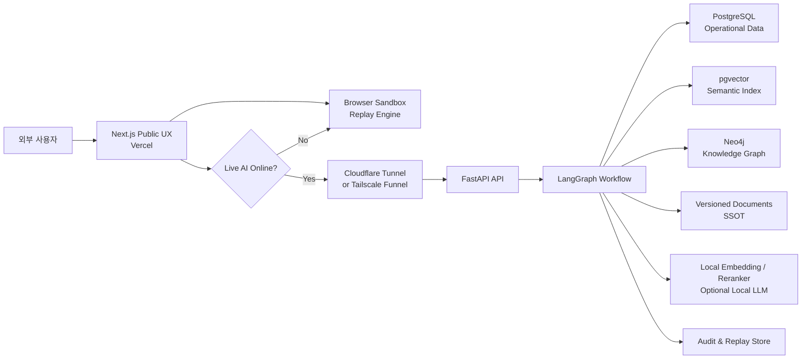
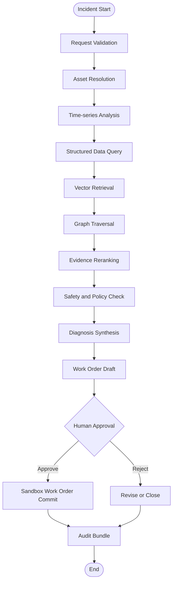

# Factory Knowledge Twin — AI Operations Console

## PoC 개발 범위 및 서비스 기본 설계

| 항목 | 내용 |
|---|---|
| 문서 상태 | Baseline v0.2 |
| 작성일 | 2026-08-26 |
| 개정 | 2026-08-28 공개 경계 준수 개정(§0.3 · 운영자 재가) |
| 프로젝트 유형 | Portfolio-grade Product PoC |
| 주요 목적 | 제조 데이터·Ontology·RAG·Agent를 운영 가능한 제품 UX로 연결하는 역량 증명 |
| 공개 운영 원칙 | Vercel Always-on Sandbox + 노트북 Live AI 이중 구조 |
| 비용 원칙 | 외부 AI API 고정비 없이 시작하며 무료 구간과 로컬 실행을 우선 사용 |
| 개발 기간 | 주말 포함 14일 |
| 실행 방식 | Claude Code 기반 멀티에이전트 병렬 개발 + 독립 검증 Gate |
| 공개 정책 | GitHub Public Repository |
| 프로젝트 라이선스 | Apache License 2.0 |

---

## 0. 확정된 기준선

### 0.1 확정 결정

| 결정 항목 | 확정 내용 |
|---|---|
| 제품명 | `Factory Knowledge Twin — AI Operations Console`을 작업명으로 사용 |
| 제품 수준 | 단순 기술 데모가 아닌 Portfolio-grade Product PoC |
| 핵심 사용자 경험 | Golden Scenario 기반 Incident 조사·근거·Graph path·작업지시서·승인·감사 |
| 공개 UX | Next.js on Vercel, 노트북 OFF 상태에서도 Sandbox와 Replay 정상 동작 |
| Live AI | 노트북의 FastAPI·LangGraph·PostgreSQL/pgvector·Neo4j에 Tunnel로 연결 |
| 공개 LLM | 초기 범위에서 제외하며 Claude Code 구독을 불특정 사용자 API로 사용하지 않음 |
| 개발 일정 | 주말 포함 14일 |
| 개발 운영 | 멀티에이전트 병렬 작업, disjoint write scope, contract-first 통합 |
| Critical Path | 구현 속도보다 검증·재현·release closure를 우선 |
| 평가 | Vector-only, Hybrid, GraphRAG + SSOT 비교 |
| 공개 저장소 | GitHub Public Repository |
| 라이선스 | Apache License 2.0 |
| 데이터 | 직접 작성한 synthetic manufacturing data만 공개 |
| 안전 경계 | Human Approval, Sandbox-only write, 실제 설비 제어 없음 |

### 0.2 측정 및 주장 경계

PoC에서 직접 측정 가능한 값과 실제 공장 Pilot에서만 검증 가능한 Business KPI를 구분한다.

```text
PoC 직접 측정
├─ Hit@K, Recall@K, MRR, nDCG
├─ Root Cause Top-3 Accuracy
├─ Citation Validity
├─ Graph Path Accuracy
├─ TTAE task-study proxy
├─ P50/P95 latency
└─ 장애·보안·Replay 검증

실제 공장 Pilot 필요
├─ MTTR 감소
├─ Unplanned Downtime 감소
├─ First-time Fix Rate 향상
├─ Maintenance Cost 감소
└─ Repeat Incident 감소
```

Synthetic PoC 결과를 실제 공장 ROI로 표현하지 않는다. Business KPI는 가설과 측정 계획으로 제시하고, PoC에서는 Operational KPI와 AI/System driver를 측정한다.

### 0.3 문서 사용 원칙

- 이 문서는 현재 제품·개발·검증·공개 기준의 단일 baseline이다.
- 실제 측정 전의 수치는 `잠정 목표`이며 측정 결과가 아니다.
- 실제 결과표에는 `Target`, `Actual`, `PASS/FAIL`, Evidence 경로를 분리한다.
- 범위·완료 기준·라이선스·공개 경계가 변경되면 이 문서를 먼저 개정한다.
- 구현 완료와 검증 완료를 구분하며 독립 검증되지 않은 기능은 Release 범위에 포함하지 않는다.

---

## 1. 문서 목적

이 문서는 `Factory Knowledge Twin — AI Operations Console`의 개발 범위, 기본 아키텍처, 서비스 구조, 기능 범위, 공개 배포 방식, 보안 경계, 검증 기준을 정의한다.

이 프로젝트는 단순히 RAG 질의응답이 작동하는 기술 데모가 아니다. 다음 역량을 하나의 완성된 제품 경험으로 보여주는 것을 목표로 한다.

- 제조 설비·센서·알람·고장 모드·SOP·안전 규정의 데이터 모델링
- 구조화 데이터, Vector Search, Knowledge Graph의 혼합 검색
- LangGraph 기반 상태형 AI 조사 workflow
- SSOT와 파생 색인의 명확한 권한·재생성 관계
- Human-in-the-loop 승인과 감사 가능한 AI 판단
- FastAPI 기반 비동기 AI 서비스 설계
- Next.js 기반 산업 운영 UX 구현
- 단일 노트북 환경에서도 외부에 공개 가능한 운영 구조

본 문서는 구현 전 기준 문서이며 상세 API Schema, 데이터 Schema, UI 시안, 작업 단위별 구현 지시서는 후속 산출물로 분리한다.

---

## 2. 프로젝트 정의

### 2.1 제품 한 줄 설명

공장 설비 이상이 발생하면 AI가 설비 상태, 센서 데이터, 정비 이력, SOP, 안전 규정과 지식 그래프를 조사하여 원인 후보와 근거를 제시하고 작업지시서 초안을 생성하는 제조 운영 지원 시스템이다.

### 2.2 핵심 가치

기존의 단순 문서 검색형 RAG를 넘어 다음 질문에 답할 수 있어야 한다.

- 지금 어떤 설비에서 문제가 발생하고 있는가?
- 어떤 센서 변화가 이상 판단의 근거인가?
- 해당 설비는 어떤 부품·공정·고장 모드와 연결되는가?
- 과거 유사 장애에서는 어떤 조치가 효과적이었는가?
- 적용해야 하는 SOP와 안전 규정은 무엇인가?
- AI가 사용한 정보는 현재 승인된 문서와 데이터인가?
- AI의 판단과 작업지시서가 어떻게 생성되었는지 재현할 수 있는가?

### 2.3 포트폴리오 메시지

> 16년 이상의 산업용 소프트웨어 경험을 바탕으로 Python AI 서비스를 제조 운영 시스템 수준으로 설계하고 제품화할 수 있다.

Python 사용 자체보다 시스템 경계, 비동기 처리, 데이터 권한, 검색 정확도, 안전한 Agent workflow, 운영 UX를 통합하는 능력을 증명한다.

---

## 3. 목표와 제외 범위

### 3.1 목표

1. 외부 사용자가 설치 없이 웹에서 전체 핵심 흐름을 체험할 수 있다.
2. 노트북이 꺼져 있어도 공개 Sandbox UX는 정상 동작한다.
3. 노트북이 켜져 있으면 실제 FastAPI·LangGraph·pgvector·Neo4j 기반 Live AI 조사를 실행한다.
4. 동일 질문을 Vector-only, Hybrid, GraphRAG 방식으로 비교할 수 있다.
5. 모든 AI 답변에 원문 근거, 문서 버전, 관계 경로를 표시한다.
6. 작업지시서 초안 생성과 사람의 승인·반려 흐름을 제공한다.
7. AI 조사 과정을 저장하고 동일 입력으로 replay할 수 있다.
8. 전체 데모를 3분 안에 설명할 수 있는 Golden Scenario를 제공한다.

### 3.2 제외 범위

초기 PoC에서는 다음을 구현하지 않는다.

- 실제 PLC, Robot, CNC, SCADA 또는 생산 설비 제어
- 실제 MES·QMS·APS·CMMS 전체 구현
- 실제 사업장 개인정보 또는 영업기밀 사용
- 다수 공장과 대규모 실시간 설비 연결
- 고가용성 cluster 및 무중단 failover
- 불특정 사용자의 임의 Python·SQL·Cypher·Shell 실행
- 공개 사용자의 무제한 문서 업로드와 자동 색인
- AI가 사람 승인 없이 정비 명령을 확정하거나 실행하는 기능
- Claude Code 구독을 불특정 방문자용 공개 AI API로 제공하는 기능

---

## 4. 대상 사용자와 주요 사용 사례

### 4.1 대상 사용자

| 사용자 | 주요 관심사 |
|---|---|
| 설비 운영자 | 현재 이상 상태, 즉시 확인할 점, 안전 조치 |
| 정비 엔지니어 | 원인 후보, 유사 장애, 부품과 SOP |
| 생산 관리자 | 생산 영향도, 우선순위, 작업지시서 상태 |
| 품질·안전 담당자 | 규정 준수, 근거 문서, 승인 이력 |
| AI·IT Architect | 검색 구조, Agent workflow, 데이터 권한, 평가 결과 |
| 포트폴리오 방문자 | 실제 제품 수준의 통합 설계와 구현 증거 |

### 4.2 대표 사용 사례

#### UC-01. 설비 이상 조사

Motor-01의 온도와 진동이 상승하면 AI가 센서 추세, 설비 구성, 과거 장애, SOP를 조사하여 원인 후보를 제시한다.

#### UC-02. 근거 경로 확인

사용자는 AI가 탐색한 `Sensor → Motor → Bearing → Failure Mode → SOP → Safety Rule` 경로와 원문을 확인한다.

#### UC-03. 작업지시서 생성 및 승인

AI가 점검 항목, 필요 부품, 예상 작업 시간, LOTO, PPE가 포함된 작업지시서를 작성하고 담당자가 수정·승인·반려한다.

#### UC-04. 검색 방식 비교

사용자는 동일 질문에 대해 Vector-only, Hybrid, GraphRAG의 근거 품질과 응답 시간을 비교한다.

#### UC-05. 감사 및 재현

사용자는 문서 revision, Ontology version, embedding model, 검색 결과와 Agent state를 포함한 실행 기록을 다시 재생한다.

---

## 5. 시연 핵심 시나리오

### 5.1 Golden Scenario

> 조립 1라인 Motor-01의 진동과 온도가 동시에 상승하고 생산 속도가 저하되었다.

AI 조사 흐름은 다음과 같다.

1. 발생한 alarm과 연결된 설비·센서를 식별한다.
2. 최근 30분의 온도·진동·전류 추이를 분석한다.
3. 생산 속도 저하와 설비 이상 시점의 상관관계를 확인한다.
4. pgvector에서 유사 정비 이력, manual, SOP를 검색한다.
5. Neo4j에서 설비 구성과 고장 모드 관계를 탐색한다.
6. 문서 revision과 안전 규정 유효성을 SSOT 기준으로 검증한다.
7. 원인 후보와 confidence를 제시한다.
8. 작업지시서 초안을 생성한다.
9. 사용자가 내용을 수정하고 승인 또는 반려한다.
10. 전체 조사 기록과 사용 근거를 audit bundle로 저장한다.

### 5.2 보조 시나리오

| 시나리오 | 목적 |
|---|---|
| 품질 불량 증가 | 설비·공정·검사 기준·품질 문서 관계 탐색 증명 |
| 에너지 사용량 급증 | 시계열 이상 탐지와 설비 운영 조건 비교 증명 |

Golden Scenario는 모든 기능이 완전하게 동작하도록 구현하고, 보조 시나리오는 확장성과 데이터 모델 재사용을 보여주는 범위로 제한한다.

---

## 6. 전체 시스템 구조



### 6.1 이중 실행 구조

| 구분 | Always-on Sandbox | Live AI |
|---|---|---|
| 실행 위치 | Vercel + 방문자 Browser | 사용자 노트북 |
| 노트북 OFF | 정상 동작 | Offline |
| AI 결과 | 검증된 실행 fixture 재생 | 실제 LangGraph 실행 |
| 사용자 조작 | 독립 Sandbox에서 가능 | 제한된 Live workflow 실행 |
| 동시 사용자 | 정적 자원 기준으로 확장 | 노트북 자원에 따라 제한 |
| 주요 목적 | 24시간 포트폴리오 체험 | 실제 기술 구현 증명 |

### 6.2 Offline fallback 원칙

- 공개 UX는 Live API 장애로 인해 빈 화면이 되지 않는다.
- Live 상태 확인 실패 시 자동으로 Replay Mode를 제안한다.
- Replay Mode도 영상이 아니라 사용자가 직접 상태를 바꿀 수 있는 상태형 Sandbox로 구현한다.
- Live와 Replay는 동일한 UI component와 event schema를 사용한다.
- 모든 Golden Scenario는 deterministic replay fixture를 보유한다.

---

## 7. 서비스 구성

### 7.1 `web-console`

| 항목 | 내용 |
|---|---|
| 기술 | Next.js, TypeScript, React |
| 배포 | Vercel Hobby |
| 역할 | Factory Overview, Incident Investigator, Graph Explorer, Evaluation, SSOT Registry 제공 |
| 상태 | 방문자별 session, IndexedDB 또는 localStorage |
| 통신 | REST + WebSocket, Live API 장애 시 Replay 전환 |

`Streamlit`은 내부 데이터 확인과 초기 workflow 실험에만 사용할 수 있으며 최종 공개 UX는 Next.js로 구현한다.

### 7.2 `demo-sandbox`

| 항목 | 내용 |
|---|---|
| 실행 위치 | 방문자 Browser |
| 역할 | Scenario 상태 머신, Agent event replay, 작업지시서 편집·승인, reset |
| 데이터 | 정적 JSON fixture, graph snapshot, 문서 excerpt |
| 격리 | 방문자별 독립 session |

방문자 A의 변경이 방문자 B에게 영향을 주지 않도록 기본 상태는 Browser storage에 저장한다.

### 7.3 `ai-api`

| 항목 | 내용 |
|---|---|
| 기술 | Python, FastAPI, Pydantic, asyncio |
| 실행 위치 | 노트북 Docker container |
| 역할 | 인증·session 제한, Incident 조사 실행, 검색 orchestration, streaming |
| 공개 방식 | Tunnel을 통한 HTTPS endpoint |

### 7.4 `agent-orchestrator`

| 항목 | 내용 |
|---|---|
| 기술 | LangGraph, LangChain |
| 역할 | 조사 단계, retry, timeout, evidence validation, approval 대기 상태 관리 |
| 상태 저장 | PostgreSQL checkpoint 또는 PoC용 local persistence |

### 7.5 `ingestion-indexer`

| 항목 | 내용 |
|---|---|
| 기술 | Python worker |
| 역할 | 문서 parsing, chunking, metadata 생성, embedding 생성, graph projection |
| 실행 방식 | 관리자 전용 CLI 또는 제한된 background job |
| 공개 여부 | 외부 사용자에게 공개하지 않음 |

### 7.6 `operational-db`

PostgreSQL이 다음 데이터를 관리한다.

- 설비·센서 기본 정보
- 센서 시계열 sample
- alarm과 incident
- 정비 이력
- work order와 승인 상태
- Agent run 및 checkpoint
- audit event
- 문서 registry와 index 상태

### 7.7 `vector-index`

`pgvector`는 다음 의미 검색을 담당한다.

- SOP와 manual chunk
- 정비 이력
- 장애 report
- 안전 규정
- 유사 Incident

pgvector는 SSOT가 아니며 원문 문서와 manifest에서 다시 생성할 수 있는 파생 색인이다.

### 7.8 `knowledge-graph`

Neo4j는 다음 multi-hop 관계 탐색을 담당한다.

- Factory → Line → Equipment → Component
- Equipment → Sensor → Alarm
- Component → Failure Mode
- Failure Mode → SOP
- SOP → Safety Rule
- Incident → Maintenance Action → Outcome

Neo4j 역시 권위 원본이 아니라 versioned Ontology와 관계 manifest에서 재생성할 수 있는 graph projection이다.

### 7.9 `ssot-registry`

SSOT는 다음을 포함한다.

- 승인된 SOP·manual·안전 규정 원문
- 문서 revision과 effective date
- 설비·센서 식별자 manifest
- Ontology와 relation schema version
- 정책과 prompt template version
- 평가 dataset version
- 각 artifact의 hash와 승인 상태

---

## 8. 데이터 권한과 SSOT 원칙

### 8.1 데이터 권한 구조

```text
Versioned Document / Manifest / Ontology / Policy
                   │
                   ├─→ PostgreSQL Registry
                   ├─→ pgvector Semantic Index
                   └─→ Neo4j Graph Projection
```

### 8.2 권한 구분

| 데이터 | 권한 수준 | 설명 |
|---|---|---|
| 승인 문서 원문 | Authoritative SSOT | AI가 인용해야 하는 최종 원문 |
| Ontology·관계 manifest | Authoritative SSOT | graph 생성의 기준 |
| 설비 운영 데이터 | Operational SSOT | 센서·alarm·work order 현재 상태 |
| pgvector | Derived Index | 삭제 후 재생성 가능 |
| Neo4j | Derived Projection | manifest에서 재생성 가능 |
| Replay fixture | Approved Demo Evidence | 특정 실행의 검증된 시연 기록 |

### 8.3 색인 일치 검증

각 index build는 다음 정보를 남긴다.

- source document ID와 revision
- source SHA-256
- chunking policy version
- embedding model과 dimension
- index 생성 시각
- ontology version
- graph projection version
- build status
- drift 또는 stale 여부

원문이 변경되었는데 색인이 갱신되지 않은 경우 UX에 `STALE INDEX` 경고를 표시한다.

---

## 9. LangGraph 조사 Workflow

### 9.1 기본 node



### 9.2 Agent state 예시

```python
class InvestigationState(TypedDict):
    run_id: str
    session_id: str
    incident_id: str
    asset_ids: list[str]
    sensor_window: dict
    structured_facts: list[dict]
    vector_evidence: list[dict]
    graph_paths: list[dict]
    safety_rules: list[dict]
    diagnosis_candidates: list[dict]
    work_order_draft: dict | None
    approval_status: str
    errors: list[dict]
```

### 9.3 실행 원칙

- 각 node는 입력과 출력을 구조화된 schema로 검증한다.
- LLM이 임의 SQL이나 Cypher를 직접 실행하지 않도록 허용된 query template과 tool만 사용한다.
- 문서 근거가 부족하면 확정 진단 대신 `insufficient_evidence`를 반환한다.
- 안전 규정 확인이 실패하면 작업지시서 승인 단계로 진행하지 않는다.
- retry는 외부 연결 또는 일시 오류에만 제한적으로 적용한다.
- 모든 node 시작·완료·실패 event를 streaming하고 audit log에 기록한다.

---

## 10. 제조 Ontology 기본 범위

### 10.1 주요 entity

| Entity | 예시 |
|---|---|
| Factory | Factory-A |
| ProductionLine | Assembly-Line-01 |
| Equipment | Motor-01, Conveyor-01 |
| Component | Bearing-A |
| Sensor | Vibration-Sensor-01 |
| Alarm | High-Vibration-Alarm |
| FailureMode | Bearing-Wear |
| SOP | SOP-MAINT-014 |
| SafetyRule | LOTO-003 |
| Incident | INC-2026-001 |
| WorkOrder | WO-2026-001 |
| MaintenanceAction | Replace-Bearing |

### 10.2 주요 relation

```text
Factory CONTAINS ProductionLine
ProductionLine CONTAINS Equipment
Equipment CONTAINS Component
Equipment MONITORED_BY Sensor
Sensor TRIGGERS Alarm
Component HAS_FAILURE_MODE FailureMode
FailureMode MITIGATED_BY SOP
SOP REQUIRES SafetyRule
Incident AFFECTS Equipment
Incident RESOLVED_BY MaintenanceAction
WorkOrder REFERENCES SOP
```

초기 모델은 AAS 개념을 참고한 lightweight model로 구현하되 AAS 전체 specification 구현을 목표로 하지 않는다. 외부 시스템과 교환 가능한 명확한 identifier, semantic ID, hierarchy를 유지하는 데 초점을 둔다.

---

## 11. UX 및 화면 범위

### 11.1 화면 구성

| Route | 화면 | 핵심 기능 |
|---|---|---|
| `/overview` | Factory Overview | 라인·설비 상태, KPI, active alarm, Incident 진입 |
| `/incidents/[id]` | Incident Investigator | Agent timeline, sensor chart, 진단, 근거, 작업지시서 |
| `/knowledge` | Knowledge Explorer | graph 탐색, AI 사용 경로 강조, 연결 문서 확인 |
| `/documents` | SSOT Registry | 문서 revision, hash, 승인·색인·drift 상태 |
| `/evaluation` | Evaluation Lab | Vector/Hybrid/GraphRAG 비교와 metric |
| `/system` | System & Audit | Live 상태, pipeline health, run replay, audit bundle |

### 11.2 Incident Investigator 배치

| 영역 | 내용 |
|---|---|
| 왼쪽 | alarm과 Agent 조사 단계 timeline |
| 중앙 | 설비 상태, 센서 chart, Digital Twin context |
| 오른쪽 | 원인 후보, confidence, 영향, 권장 조치 |
| 하단 | source evidence, graph path, SOP, work order |

### 11.3 시각 원칙

- 일반적인 chat-first UI를 사용하지 않는다.
- 산업 운영 console에 맞는 dense but legible 화면을 구성한다.
- neutral dark background를 기본으로 한다.
- 정상은 green, 주의는 amber, 위험은 red로 표시한다.
- AI evidence와 graph path는 cyan 또는 blue로 구분한다.
- 애니메이션은 조사 단계 진행, graph path 강조, sensor streaming에만 사용한다.
- 주요 status는 색상만으로 구분하지 않고 icon과 text label을 병행한다.
- 1440px desktop을 핵심 시연 viewport로 하고 tablet까지 대응한다.
- 모바일은 overview alert와 승인 확인을 우선 제공하고 복잡한 graph 편집은 제외할 수 있다.

---

## 12. 기능 범위와 우선순위

### 12.1 P0 — 반드시 구현

#### 공개 Sandbox

- Factory Overview
- Golden Scenario 실행·중지·재설정
- 방문자별 session 격리
- Agent event replay
- 센서 추세 chart
- graph evidence path 표시
- source document preview와 인용 문장 강조
- 작업지시서 편집·승인·반려
- Vector-only / Hybrid / GraphRAG 결과 비교
- Live API online/offline 감지
- Live 장애 시 Replay fallback

#### Live AI

- FastAPI async API
- LangGraph state workflow
- PostgreSQL structured query
- pgvector semantic retrieval
- Neo4j multi-hop traversal
- local embedding
- evidence reranking
- safety policy validation
- WebSocket progress streaming
- run audit와 replay fixture export

#### 운영·보안

- health endpoint
- request/session rate limit
- maximum request size
- tool allowlist
- synthetic data only
- one-click demo reset
- secret의 repository 미포함

### 12.2 P1 — 완성도 향상

- 보조 시나리오 2개
- retrieval parameter 비교
- source revision drift 시뮬레이션
- stale index 경고와 rebuild 상태
- 사용자 feedback 수집
- Evaluation dashboard
- run-to-run diff
- 한국어·영어 UI 전환
- architecture와 기술 선택 설명 화면

### 12.3 P2 — 후속 확장

- OPC UA simulator 연계
- AAS package import/export 일부 지원
- 실제 CMMS adapter mock
- role 기반 승인 workflow
- multi-tenant cloud architecture
- background ingestion queue
- OpenTelemetry trace와 metrics export
- 실제 모델 API 선택적 연결

---

## 13. API 기본 범위

### 13.1 Public/Live API

> 🔴 **정오(08-31 운영자 재가 · 원장 Q-47)**: 본 표는 초안 명칭이다. Public/Live API 표면의 **정본 = `packages/contracts/rest-api-v0.1.md`(동결 본문 + append 전건 · Phase 1~3 구현·검증 착지분)** — 버전 접두(`/api/v1/…`)·라우트 이름이 다른 곳은 계약이 우선하며, CORS allowlist·공개 노출 경계(§16)도 계약 표면 기준으로 세운다. 표 자체는 원문 보존.

| Method | Endpoint | 설명 |
|---|---|---|
| `GET` | `/api/v1/health` | Live engine과 dependency 상태 |
| `GET` | `/api/v1/demo/capabilities` | Live/Replay 지원 기능 |
| `GET` | `/api/v1/incidents/{id}` | Incident 상세 조회 |
| `POST` | `/api/v1/investigations` | 제한된 AI 조사 시작 |
| `GET` | `/api/v1/investigations/{run_id}` | 조사 상태와 결과 조회 |
| `WS` | `/api/v1/investigations/{run_id}/events` | 조사 event streaming |
| `POST` | `/api/v1/work-orders/{id}/decision` | 승인·반려·수정 |
| `GET` | `/api/v1/evidence/{id}` | 근거 metadata와 preview |
| `GET` | `/api/v1/graph/paths/{run_id}` | AI가 사용한 graph path |
| `GET` | `/api/v1/evaluations/{scenario_id}` | 검색 방식 비교 결과 |
| `POST` | `/api/v1/demo/reset` | 현재 session 초기화 |

### 13.2 관리자 전용 API/CLI

- 문서 등록과 revision 승인
- embedding/index build
- graph projection build
- replay fixture export
- evaluation dataset 실행
- demo seed와 reset

관리자 기능은 Public Tunnel을 통해 노출하지 않거나 별도 인증 정책으로 차단한다.

---

## 14. 공개 배포 구조

### 14.1 Always-on 공개 영역

| 구성 요소 | 서비스 | 비용 전략 |
|---|---|---|
| Next.js UX | Vercel Hobby | 개인·비상업 포트폴리오 무료 구간 |
| 정적 fixture·graph snapshot | Vercel static assets | 무료 구간 |
| 방문자 상태 | Browser IndexedDB/localStorage | 무료 |
| 선택적 PostgreSQL | Neon Free | pgvector와 소규모 cloud data |
| 선택적 Graph DB | Neo4j AuraDB Free | graph 실조회 증명 |

기본 공개 체험은 cloud DB 장애나 pause에도 동작하도록 정적 snapshot을 포함한다.

### 14.2 노트북 Live 영역

```text
Windows Laptop
├─ Docker Compose
│  ├─ ai-api
│  ├─ ingestion-worker
│  ├─ postgres-pgvector
│  ├─ neo4j
│  └─ observability-lite
├─ local model cache
└─ cloudflared 또는 tailscale
```

### 14.3 Tunnel 선택

| 선택지 | 장점 | 제약 | 권장 용도 |
|---|---|---|---|
| Cloudflare Named Tunnel | 고정 domain, inbound port 불필요, HTTPS | Cloudflare에 연결한 domain 필요 | 최종 공개 Live endpoint |
| Tailscale Funnel | 별도 domain 없이 `ts.net` HTTPS 가능 | beta, 비고정 bandwidth limit | 초기 공개 Live demo |
| Cloudflare Quick Tunnel | 설정이 매우 간단 | 임시 URL, SLA 없음, SSE 미지원 | 개발 확인 전용 |

### 14.4 노트북 운영 조건

- 전원 연결 상태 유지
- sleep과 hibernate 비활성화
- Docker와 Tunnel service 자동 시작
- 배터리·온도·디스크 사용량 monitoring
- 재부팅 후 health check
- Live 동시 실행 수 제한
- Notebook offline 시 public UX가 Replay로 자동 전환

---

## 15. 모델 및 비용 전략

### 15.1 기본 전략

| 작업 | 기본 방식 |
|---|---|
| 개발·코드 작성 | Claude Code 구독 활용 |
| 문서 embedding | 로컬 multilingual embedding model |
| 반복 retrieval | pgvector + Neo4j |
| reranking | 로컬 reranker |
| 공개 Sandbox 응답 | 승인된 replay fixture |
| Live 진단 synthesis | 로컬 LLM 또는 소유자 통제 실행 |
| 공개 범용 AI 요청 | 초기 범위에서 제외 |

### 15.2 Claude Code 사용 경계

Claude.ai/Claude Code 구독과 Anthropic API는 별도 상품이므로 구독을 불특정 사용자의 공개 API처럼 사용하지 않는다.

- Claude Code는 개발, test fixture 작성, 소유자가 통제하는 시연에 사용한다.
- 공개 사용자의 요청은 Replay 또는 로컬 모델로 처리한다.
- Anthropic API 연결은 별도 비용 승인이 있을 때만 P2 기능으로 추가한다.
- Claude credential, session, token은 Browser와 public API에 전달하지 않는다.

### 15.3 예상 고정비

| 항목 | 초기 비용 |
|---|---:|
| Vercel Hobby | 0원 |
| Neon Free | 0원 |
| Neo4j AuraDB Free | 0원 |
| Cloudflare Tunnel | 0원, custom domain 비용 별도 |
| Tailscale Personal/Funnel | 개인·비상업 무료 구간 |
| Local embedding/LLM | API 비용 0원, 노트북 자원 사용 |
| Anthropic API | 초기 사용 안 함 |

무료 플랜의 quota와 정책은 변경될 수 있으므로 실제 배포 직전에 다시 확인한다.

---

## 16. 보안 및 공개 조작 경계

### 16.1 공개 가능한 조작

- 준비된 공장·라인·설비 선택
- 승인된 Incident scenario 선택
- 정의된 범위의 sensor 값과 threshold 변경
- 제한된 검색 방식과 parameter 변경
- 작업지시서 sandbox 수정
- 사용자 자신의 session 승인·반려·reset
- graph node와 evidence 탐색

### 16.2 공개 금지

- 임의 SQL·Cypher·Python·Shell 실행
- local filesystem 접근
- 임의 LangGraph tool 이름과 argument 지정
- host volume 탐색
- 무제한 파일 업로드
- 실제 설비 제어 명령
- 다른 사용자의 session 조회·변경
- 관리자 index build와 SSOT 승인 기능

### 16.3 보호장치

- HTTPS only
- Cloudflare Turnstile 또는 동등한 bot protection
- IP와 anonymous session별 rate limit
- Live AI 동시 실행 1~2개와 bounded queue
- 요청 body와 자연어 길이 제한
- allowlist 기반 scenario·asset·tool 선택
- session TTL과 자동 정리
- CORS allowlist
- security header와 CSP
- Pydantic input/output validation
- parameterized SQL과 고정 Cypher template
- container privilege 최소화
- secret은 environment variable 또는 local secret store에서 주입
- synthetic manufacturing data만 공개

### 16.4 Human-in-the-loop

AI는 다음 작업을 자동 확정하지 않는다.

- 설비 정지
- 작업지시서 최종 승인
- 부품 발주
- 안전 절차 생략
- 실제 제어 시스템 변경

PoC의 승인 결과는 Sandbox 또는 demo operational DB에만 기록한다.

---

## 17. 비기능 요구사항

### 17.1 성능 목표

| 항목 | 목표 |
|---|---|
| 공개 UX 최초 표시 | 정적 자원 기준 3초 이내 목표 |
| Replay 시작 | 사용자 실행 후 1초 이내 |
| Live progress 첫 event | 정상 상태에서 3초 이내 목표 |
| Golden Scenario 전체 조사 | 로컬 환경 기준 10~30초 목표 |
| 화면 조작 응답 | 100ms 내 체감 반응 목표 |
| Live 동시 조사 | 초기 1~2개 |

실제 목표값은 노트북 사양과 모델 benchmark 후 확정한다.

### 17.2 안정성

- Live API timeout 시 Replay Mode로 전환한다.
- 동일 `run_id` event를 중복 처리하지 않는다.
- 브라우저 재접속 시 현재 run 상태를 복구한다.
- 모든 Golden Scenario는 one-click reset이 가능해야 한다.
- 공개 DB가 중지되어도 core Replay UX는 유지한다.

### 17.3 접근성

- 주요 기능 keyboard navigation 지원
- status를 색상만으로 구분하지 않음
- chart와 graph에 textual summary 제공
- focus state 명확화
- reduced motion 지원
- 주요 화면 contrast 검증

### 17.4 관찰 가능성

- request ID, session ID, run ID 분리
- node별 latency와 status 기록
- retrieval source count와 score 기록
- error category 구조화
- credential과 원문 민감 정보 log 금지
- Golden Scenario replay export 지원

---

## 18. 평가 체계

### 18.1 비교 대상

1. Vector-only RAG
2. Vector + Metadata/SQL Hybrid
3. Vector + GraphRAG + SSOT Validation

### 18.2 평가 지표

| 지표 | 설명 |
|---|---|
| Asset Identification Accuracy | 올바른 설비·부품 식별률 |
| Evidence Recall@K | 정답 근거가 검색 결과에 포함되는 비율 |
| SOP Retrieval Accuracy | 올바른 SOP 검색률 |
| Graph Path Correctness | 관계 경로가 Ontology와 일치하는 비율 |
| Unsupported Claim Count | 출처 없는 주장 수 |
| Safety Rule Omission | 필요한 안전 규정 누락 수 |
| Citation Validity | 인용 문서 ID·revision·문장이 실제 원문과 일치하는 비율 |
| Response Latency | 전체와 node별 응답 시간 |
| Work Order Completeness | 필수 점검·안전·부품 항목 포함률 |

### 18.3 평가 dataset

- 40개 검증 질문
- Golden Scenario 관련 hard question 포함
- 명칭이 유사한 설비를 구분해야 하는 질문
- 여러 관계를 거쳐야 답할 수 있는 multi-hop 질문
- 문서 revision 충돌 질문
- 근거가 부족하여 답변을 보류해야 하는 질문
- 안전 규정을 반드시 포함해야 하는 질문

평가 결과는 재현할 수 있도록 dataset version, source hash, model·embedding version, retrieval parameter를 함께 저장한다.

---

## 19. 데이터 규모

초기 PoC는 작은 범위를 깊게 구현한다.

| 데이터 | 권장 규모 |
|---|---:|
| Factory | 1 |
| Production Line | 1 |
| 주요 Equipment | 3 |
| Component | 8~12 |
| Sensor | 8~12 |
| Failure Mode | 8~15 |
| SOP·Manual·안전 문서 | 30~50 |
| Maintenance History | 50~100 |
| Incident Scenario | 3 |
| 완전 구현 Golden Scenario | 1 |
| 평가 질문 | 40 |

실제 제조사 문서를 무단 사용하지 않고 직접 만든 synthetic document와 공개 specification을 사용한다.

---

## 20. 저장소 기본 구조

```text
factory-knowledge-twin/
├─ apps/
│  └─ web-console/                 # Next.js public UX
├─ services/
│  ├─ ai-api/                      # FastAPI
│  ├─ agent-orchestrator/          # LangGraph workflow
│  └─ ingestion-indexer/           # document/index pipeline
├─ packages/
│  ├─ contracts/                   # OpenAPI/event/schema contracts
│  ├─ ontology/                    # entity/relation definitions
│  └─ demo-fixtures/               # deterministic replay data
├─ data/
│  ├─ ssot/                        # versioned synthetic documents
│  ├─ manifests/                   # asset/document/index manifests
│  ├─ seeds/                       # database seeds
│  └─ evaluation/                  # questions and expected evidence
├─ infra/
│  ├─ docker/
│  ├─ tunnel/
│  └─ scripts/
├─ tests/
│  ├─ contract/
│  ├─ integration/
│  ├─ evaluation/
│  ├─ security/
│  └─ e2e/
├─ docs/
│  ├─ architecture/
│  ├─ decisions/
│  ├─ demo/
│  └─ operations/
├─ compose.yaml
├─ README.md
└─ LICENSE
```

Frontend와 Python service를 한 저장소에서 관리하되 contract와 data fixture를 공유하도록 구성한다. 실제 bootstrap 단계에서 monorepo tooling과 package manager는 별도 승인 후 확정한다.

---

## 21. 개발 단계

### Phase 0. 제품·UX 방향 확정

**산출물**

- UX visual direction 3안
- 핵심 화면 wireframe
- Golden Scenario storyboard
- 최종 design direction 승인

**완료 증거**

- 1440px 핵심 화면 mock
- 3분 demo script
- route와 주요 interaction 목록

### Phase 1. SSOT·Ontology·Synthetic Data

**산출물**

- asset hierarchy
- ontology v0.1
- 문서 registry와 manifest
- Golden Scenario seed
- evaluation 질문 초안

**완료 증거**

- 모든 asset ID unique 검증
- relation schema validation
- 문서 hash와 revision 검증
- database seed 재실행 가능

### Phase 2. Retrieval 및 Agent Backend

**산출물**

- FastAPI skeleton
- pgvector ingestion/retrieval
- Neo4j projection/traversal
- LangGraph investigation workflow
- structured audit event

**완료 증거**

- API contract test
- Golden Scenario integration test
- Vector/Hybrid/GraphRAG 동일 질문 실행 결과
- evidence ID와 source 문장 일치 검증

### Phase 3. Always-on Sandbox UX

**산출물**

- Next.js 핵심 화면
- browser session sandbox
- deterministic replay engine
- work order interaction
- graph evidence visualization

**완료 증거**

- 노트북 OFF 상태에서 전체 Golden Scenario 완료
- 방문자 session isolation test
- 주요 keyboard interaction test
- desktop viewport visual QA

### Phase 4. Live AI 연결

**산출물**

- WebSocket streaming
- Tunnel 연결
- Live/Offline detection
- fallback과 queue
- one-click reset

**완료 증거**

- 외부 네트워크와 모바일에서 접속
- Live 조사 실행
- 노트북 종료 시 Replay 전환
- 동시 요청 제한과 timeout 검증

### Phase 5. 평가·보안·운영 완성

**산출물**

- Evaluation Lab
- rate limit와 bot protection
- audit/replay
- deployment/runbook
- demo 장애 대응 절차

**완료 증거**

- evaluation report
- abuse negative test
- credential scan
- clean environment 실행 검증
- restart recovery test

### Phase 6. 포트폴리오 패키징

**산출물**

- 공개 URL
- 60~90초 핵심 영상
- 3분 전체 시연 영상
- architecture diagram
- case study
- GitHub README

**완료 증거**

- 새 방문자가 별도 설명 없이 Golden Scenario 실행
- 모든 공개 link 정상
- 공개 repository에 secret·민감 데이터 없음
- 핵심 기술 선택과 trade-off 설명 가능

---

## 22. 테스트 및 검증 범위

### 22.1 Unit Test

- chunking과 metadata 생성
- sensor rule과 anomaly calculation
- graph relation mapping
- evidence validation
- work order schema
- Agent node transition

### 22.2 Contract Test

- FastAPI OpenAPI schema
- Frontend API client type
- WebSocket event schema
- Replay fixture와 Live event 호환성

### 22.3 Integration Test

- PostgreSQL + pgvector 검색
- Neo4j path query
- LangGraph end-to-end workflow
- SSOT revision 변경과 stale index 검출
- approval checkpoint resume

### 22.4 E2E Test

- Overview에서 Incident 진입
- Golden Scenario 시작
- 조사 progress 확인
- evidence와 graph path 확인
- work order 수정·승인
- audit run replay
- Live offline fallback
- Demo Reset

### 22.5 Security Test

- SQL/Cypher injection negative case
- 허용되지 않은 tool 요청
- 과도한 request body
- 다른 session ID 접근
- rate limit 초과
- credential과 environment 정보 노출 여부
- public admin endpoint 차단

### 22.6 External Verification

- 다른 Wi-Fi 또는 mobile network에서 공개 URL 접속
- 노트북 ON/OFF 전환 확인
- desktop/tablet/mobile 주요 viewport 확인
- Chrome/Edge 주요 흐름 확인
- 새 사용자 관점의 3분 task completion 확인

---

## 23. PoC 완료 기준

다음 항목을 모두 만족해야 Portfolio-grade PoC 완료로 판단한다.

- [ ] 공개 URL이 노트북 OFF 상태에서도 열린다.
- [ ] 방문자는 로그인 없이 Golden Scenario를 실행할 수 있다.
- [ ] 방문자별 조작 상태가 서로 격리된다.
- [ ] Vector-only, Hybrid, GraphRAG 결과를 비교할 수 있다.
- [ ] AI 결과에 원문 citation과 revision이 표시된다.
- [ ] AI가 사용한 graph path를 확인할 수 있다.
- [ ] 작업지시서를 수정하고 승인·반려할 수 있다.
- [ ] Live AI가 노트북의 FastAPI·LangGraph와 연결된다.
- [ ] 노트북 OFF 또는 Live 장애 시 Replay로 정상 전환된다.
- [ ] SSOT와 pgvector·Neo4j 파생 상태를 구분해서 보여준다.
- [ ] stale index 또는 문서 revision 충돌을 감지한다.
- [ ] Golden Scenario 실행을 audit bundle로 다시 재생할 수 있다.
- [ ] 공개 endpoint에 임의 코드·SQL·Cypher 실행 경로가 없다.
- [ ] 정량 evaluation 결과가 제공된다.
- [ ] 한 번의 reset으로 시연 초기 상태를 복원한다.
- [ ] 60~90초 소개 영상과 3분 전체 시연 영상이 준비된다.
- [ ] README만으로 로컬 실행과 시스템 구조를 이해할 수 있다.

---

## 24. 주요 위험과 대응

| 위험 | 영향 | 대응 |
|---|---|---|
| 노트북이 꺼지거나 sleep 진입 | Live AI 중단 | Always-on Replay, 전원 정책, offline indicator |
| 로컬 LLM 응답 지연 | 시연 품질 저하 | streaming, 제한된 prompt, replay fallback |
| 무료 Cloud DB pause | 첫 조회 지연 | 정적 snapshot 우선, health check, graceful fallback |
| 공개 사용자 abuse | 노트북 과부하 | Turnstile, rate limit, concurrency 1~2, queue |
| RAG 근거 오류 | 신뢰도 저하 | citation validation, SSOT revision check, evaluation dataset |
| Graph 과도한 복잡성 | UX와 개발 지연 | Golden Scenario 관계만 먼저 구현 |
| 실제 제조 데이터 부족 | 현실감 저하 | 일관된 synthetic dataset과 domain rule 작성 |
| Claude 구독 사용 경계 | 정책·비용 위험 | 공개 API 미사용, 개발·소유자 시연에 한정 |
| 기능 범위 확대 | 완성도 저하 | P0 고정, P1/P2는 P0 완료 후 승인 |
| 화려한 화면에 비해 실제 기능 부족 | 포트폴리오 신뢰도 저하 | 모든 핵심 화면을 실제 workflow와 연결 |

---

## 25. 구현 시작 전 결정 사항

Public GitHub, Apache-2.0, 14일 일정, 멀티에이전트 운영, 이중 실행 구조는 확정됐다. 다음 세부 결정은 실제 프로젝트 bootstrap 또는 구현 전에 확정한다.

1. 최종 제품명과 repository 이름
2. UX visual direction
3. Next.js project 구성과 monorepo tooling
4. Python package manager와 지원 Python version
5. local embedding 및 reranker model
6. Live synthesis에 사용할 local LLM 여부
7. Cloudflare custom domain 또는 Tailscale Funnel 선택
8. PostgreSQL·Neo4j를 전부 local로 둘지 무료 cloud를 혼합할지 여부
9. 공개 사용자의 자연어 질문 허용 범위
10. portfolio case study와 Benchmark raw result 공개 범위

위 결정이 완료되기 전에는 전체 기능 구현보다 Golden Scenario 데이터와 UX 목표를 먼저 승인한다.

---

## 26. 권장 다음 산출물

구현 전에 다음 문서를 순서대로 작성한다.

1. `product-brief.md` — 사용자, 문제, 가치, 시연 narrative
2. `ux-direction.md` — 3개 visual direction과 선택 근거
3. `system-architecture.md` — container, network, data flow, trust boundary
4. `data-ontology-spec.md` — entity, relation, identifier, SSOT schema
5. `api-event-contracts.md` — REST, WebSocket, replay event schema
6. `golden-scenario-spec.md` — seed data, expected evidence, demo script
7. `evaluation-plan.md` — dataset, metric, baseline, acceptance threshold
8. `implementation-plan.md` — review 가능한 작업 단계와 검증 command

---

## 27. 참고 자료

### 제품·제조 방향

- [IDTA Asset Administration Shell Specifications](https://industrialdigitaltwin.org/en/content-hub/aasspecifications)
- [OPC UA](https://opcfoundation.org/about/opc-technologies/opc-ua/)
- [W3C SSN/SOSA](https://www.w3.org/TR/vocab-ssn/)

### AI·데이터 기술

- [LangGraph Documentation](https://docs.langchain.com/oss/python/langgraph/overview)
- [FastAPI Documentation](https://fastapi.tiangolo.com/)
- [pgvector](https://github.com/pgvector/pgvector)
- [Neo4j GraphRAG Python](https://neo4j.com/docs/neo4j-graphrag-python/current/)

### 공개 배포·무료 구간

- [Vercel Hobby Plan](https://vercel.com/docs/plans/hobby)
- [Cloudflare Tunnel](https://developers.cloudflare.com/tunnel/)
- [Cloudflare Tunnel Setup](https://developers.cloudflare.com/tunnel/setup/)
- [Cloudflare Turnstile Plans](https://developers.cloudflare.com/turnstile/plans/)
- [Tailscale Funnel](https://tailscale.com/docs/features/tailscale-funnel)
- [Neon Pricing and Free Plan](https://neon.com/pricing)
- [Neon pgvector Concepts](https://neon.com/docs/ai/ai-concepts)
- [Neo4j AuraDB Free](https://neo4j.com/free-graph-database/)
- [Anthropic Subscription and API Billing Separation](https://support.anthropic.com/en/articles/9876003-i-subscribe-to-a-paid-claude-ai-plan-why-do-i-have-to-pay-separately-for-api-usage-on-console)

### GitHub·라이선스

- [GitHub Licensing a Repository](https://docs.github.com/en/repositories/managing-your-repositorys-settings-and-features/customizing-your-repository/licensing-a-repository)
- [GitHub Actions Billing and Usage](https://docs.github.com/en/actions/concepts/billing-and-usage)
- [GitHub Security Features](https://docs.github.com/en/code-security/getting-started/github-security-features)
- [Apache License 2.0](https://www.apache.org/licenses/LICENSE-2.0)
- [Applying Apache License 2.0](https://www.apache.org/legal/apply-license.html)

---

## 28. 현재 권고안

현 단계의 기본 권고안은 다음과 같다.

```text
Public UX        : Next.js on Vercel Hobby
Always-on Demo   : Browser Sandbox + Deterministic Replay
Live Backend     : FastAPI + LangGraph on Windows Laptop/Docker
Structured DB    : PostgreSQL
Vector Search    : pgvector
Knowledge Graph  : Neo4j
Embedding        : Local Multilingual Embedding Model
Reranking        : Local Reranker
Public Ingress   : Cloudflare Named Tunnel 또는 Tailscale Funnel
SSOT             : Versioned Documents + Manifests + Ontology + Policies
Public LLM       : 초기 범위에서 제외
Claude Code      : 개발 및 소유자 통제 시연에 사용
Safety           : Human Approval, Sandbox-only Write, No Equipment Control
Source Hosting   : GitHub Public Repository
License          : Apache License 2.0
Schedule         : 14 Calendar Days
Delivery Model   : Multi-agent Parallel Build + Independent Verification
```

이 구조는 노트북 한 대와 무료 서비스를 이용해 외부 공개 가능성, 실제 AI backend, 제조 지식 구조, 운영 안전성, 제품 UX를 동시에 보여주는 것을 목표로 한다.

---

## 29. KPI Framework

### 29.1 KPI 인과 구조

기술 지표가 현장 가치와 어떻게 연결되는지를 다음 구조로 관리한다.

```text
[Business Outcome — Pilot에서 검증]
MTTR 감소 · 비가동 시간 감소 · 정비 비용 감소
                         ▲
                         │
[Operational KPI — PoC 통제 실험으로 측정]
조사시간 단축 · 원인 후보 적중 · 작업지시서 준비도
                         ▲
                         │
[AI Quality Driver — 자동 평가]
Hit@K · MRR · Graph Path · Citation · Abstention
                         ▲
                         │
[System Driver — 자동 성능 측정]
P50/P95 · 성공률 · Queue · 장애복구 · Replay 동등성

[Guardrail — 모든 계층에 적용]
근거 없는 Critical Claim 0건
안전 규정 누락 0건
Human Approval 우회 0건
```

### 29.2 North Star KPI

#### Evidence-backed Investigation Completion Rate

`근거 기반 조사 완료율`을 PoC 대표 KPI로 사용한다.

```text
근거 기반 조사 완료율
= 다음 조건을 모두 만족한 Incident 수
  ÷ 전체 평가 Incident 수
```

모든 통과 조건:

- 올바른 설비·부품 식별
- 실제 원인이 Top-3 후보에 포함
- 필수 SOP 검색 성공
- 필수 안전 규정 포함
- Critical Claim의 Citation 유효
- 작업지시서 필수 항목 충족
- Human Approval 이전 Commit 없음

| 구분 | 잠정 목표 | Target 근거 |
|---|---:|---|
| Golden Scenario | 100% | 시연 기준선이므로 모든 조건 통과 필요 |
| 전체 평가셋 | 90% 이상 | 초기 PoC acceptance target |
| Critical Citation | 100% | 신뢰 Guardrail |
| 안전 규정 누락 | 0건 | Safety Guardrail |
| 승인 우회 | 0건 | Human-in-the-loop Guardrail |

### 29.3 Primary KPI 1 — Time to Actionable Evidence

```text
TTAE
= Incident 조사 시작
  → 원인 후보 + SOP + 안전 규정 + 유효 근거 준비 시점
```

```text
조사시간 단축률
= (수작업 TTAE - AI 지원 TTAE)
  ÷ 수작업 TTAE
  × 100
```

Baseline task는 동일한 문서와 질문을 사용해 일반 keyword 검색 방식으로 수행한다. AI Assisted task는 Factory Knowledge Twin을 사용한다. 본인 외 평가자가 참여할 수 있으면 2~3명의 중앙값을 사용한다.

| KPI | 잠정 목표 |
|---|---:|
| 수작업 대비 TTAE 단축 | 50% 이상 |
| Golden Scenario 사용자 조사 완료 | 3분 이내 |
| First Evidence P95 | 5초 이내 |
| 전체 Live Workflow P95 | 30초 이내 |

### 29.4 Primary KPI 2 — Root Cause Top-3 Accuracy

```text
Root Cause Top-3 Accuracy
= 실제 원인이 AI의 상위 3개 원인 후보에 포함된 Incident 수
  ÷ 전체 답변 가능한 Incident 수
```

| KPI | 잠정 목표 |
|---|---:|
| Golden Scenario Root Cause Top-3 | 100% |
| 전체 평가셋 Root Cause Top-3 | 90% 이상 |
| Asset Identification Accuracy | 95% 이상 |
| Evidence Hit@5 | 90% 이상 |
| Graph Path Accuracy | 90% 이상 |

### 29.5 Primary KPI 3 — Work Order Readiness Rate

```text
Work Order Readiness Rate
= 필수 항목을 모두 포함해 사람의 검토 단계로 전달 가능한 작업지시서 수
  ÷ 전체 생성 작업지시서 수
```

필수 항목:

- 대상 설비·부품
- 증상과 센서 이상
- 원인 후보
- 점검·정비 절차
- 적용 SOP
- LOTO·PPE·안전 규정
- 필요 부품
- 예상 작업 시간
- Citation
- 승인 상태

| KPI | 잠정 목표 |
|---|---:|
| Work Order Schema Completeness | 100% |
| 필수 SOP 포함률 | 100% |
| 필수 안전 규정 포함률 | 100% |
| Critical Claim Citation | 100% |
| First-pass Approval Rate | 실제 Human Review 후 측정 |

### 29.6 Driver KPI

| Driver KPI | 정의 |
|---|---|
| Evidence Hit@5 | 정답 근거가 Top-5에 하나 이상 포함된 질문 비율 |
| Recall@5 | 전체 정답 근거 중 Top-5에서 찾은 비율 |
| MRR | 첫 번째 정답 근거 순위 역수의 평균 |
| nDCG@5 | 관련성이 높은 근거가 상단에 배치된 정도 |
| Graph Path Accuracy | 반환 관계 경로와 Ground Truth 일치율 |
| Citation Validity | Document ID·Revision·원문 문장 일치율 |
| Abstention Accuracy | 답이 없을 때 확정 답변을 보류한 비율 |
| Live Workflow Success | 정상 종료된 Live run 비율 |
| Replay Equivalence | Live와 Replay의 핵심 결과 논리적 일치율 |
| First Evidence Latency | 첫 유효 근거가 표시될 때까지의 시간 |

### 29.7 Guardrail KPI

| Guardrail | 허용 기준 |
|---|---:|
| Unsupported Critical Claim | 0건 |
| Safety Rule Omission | 0건 |
| Human Approval Bypass | 0건 |
| Invalid Citation | 0건 |
| Invalid Graph Relation | 0건 |
| Prompt Injection Success | 0건 |
| Cross-session Data Access | 0건 |
| Public Admin Endpoint Access | 0건 |
| Demo Reset Failure | 0건 |
| Live 장애로 Public UX 전체 중단 | 0건 |

### 29.8 실제 공장 Pilot KPI

다음은 PoC 성과로 주장하지 않고 Pilot Hypothesis로만 제시한다.

| Business KPI | 측정 정의 | Pilot 가설 |
|---|---|---|
| MTTR | 장애 발생부터 정상 복구까지 평균 시간 | TTAE 단축이 MTTR 감소에 기여 |
| Unplanned Downtime | 계획되지 않은 비가동 시간 | 조기 조사와 정확한 작업계획으로 감소 |
| First-time Fix Rate | 첫 정비 조치로 해결된 비율 | 원인 후보·유사 이력 검색으로 향상 |
| Repeat Incident Rate | 동일 Failure Mode 재발률 | 유사 장애와 예방 조치 연결로 감소 |
| Maintenance Preparation Time | 문서·부품·절차 준비 시간 | SOP 자동 연결로 단축 |
| SOP Compliance Rate | 승인된 SOP에 따른 작업 비율 | Safety validation으로 향상 |
| Maintenance Cost per Incident | 인력·부품·비가동 비용 | Pilot에서 전후 비교 필요 |

### 29.9 KPI Event Contract

다음 event를 수집해 KPI가 수작업 계산에 의존하지 않도록 한다.

```text
incident_started
investigation_started
asset_resolved
first_evidence_found
retrieval_completed
graph_path_completed
diagnosis_ready
work_order_drafted
human_review_started
work_order_approved
work_order_rejected
investigation_completed
fallback_activated
```

각 event 공통 field:

```text
timestamp
run_id
session_id
scenario_id
strategy
dataset_version
ssot_manifest_hash
ontology_version
model_version
status
duration_ms
```

### 29.10 KPI 결과표

실제 결과가 없을 때 `Actual`은 `Not measured`로 유지한다.

| Executive KPI | Baseline | AI Assisted | Target | Actual | 판정 |
|---|---:|---:|---:|---:|---|
| 근거 기반 조사 완료율 | N/A | 측정 대상 | ≥90% | Not measured | PENDING |
| TTAE 단축률 | 수작업 측정 | AI 측정 | ≥50% | Not measured | PENDING |
| Root Cause Top-3 | 검색 Baseline | AI 측정 | ≥90% | Not measured | PENDING |
| Work Order Readiness | 수작업 측정 | AI 측정 | 100% | Not measured | PENDING |

---

## 30. Benchmark & Evaluation Protocol

### 30.1 평가 목적

다음 주장을 재현 가능한 데이터로 검증한다.

- GraphRAG가 모든 질문에서 무조건 우수한 것이 아니라 multi-hop 질문에서 실질적 이점이 있는가?
- Metadata/SQL Hybrid가 유사 설비 식별과 구조화 질문에서 도움이 되는가?
- SSOT validation이 오래된 문서나 revision 충돌을 차단하는가?
- 정확도 향상이 추가 latency와 자원 사용을 정당화하는가?
- 근거가 없을 때 안전하게 답변을 보류하는가?

### 30.2 평가 질문 구성

초기 평가셋은 40개 질문으로 구성한다.

| 유형 | 문항 수 | 검증 목적 |
|---|---:|---|
| 직접 문서 검색 | 8 | 기본 Vector retrieval |
| 설비·부품 식별 | 8 | Metadata와 entity resolution |
| Multi-hop 관계 | 8 | Neo4j GraphRAG 효과 |
| 문서 Revision 충돌 | 6 | SSOT validation |
| 안전 규정 | 5 | Safety rule recall |
| 답변 불가능 | 5 | Abstention과 hallucination 방지 |
| 합계 | 40 |  |

### 30.3 Ground Truth Schema

```json
{
  "question_id": "Q-MULTIHOP-001",
  "category": "multi_hop",
  "question": "Motor-01 진동 상승과 관련된 부품, 고장 모드, SOP는 무엇인가?",
  "answerable": true,
  "expected_asset_ids": ["Motor-01", "Bearing-A"],
  "relevant_document_ids": ["MANUAL-MOTOR-001", "SOP-MAINT-014"],
  "relevant_chunk_ids": [
    "MANUAL-MOTOR-001#chunk-07",
    "SOP-MAINT-014#chunk-03"
  ],
  "expected_graph_path": [
    "Motor-01",
    "Bearing-A",
    "Bearing-Wear",
    "SOP-MAINT-014"
  ],
  "required_safety_rules": ["LOTO-003"],
  "expected_facts": [
    "베어링 마모 가능성",
    "진동 추세 확인",
    "LOTO 적용 후 점검"
  ]
}
```

### 30.4 비교 전략

1. Vector-only
2. Vector + Metadata/SQL Hybrid
3. Vector + Neo4j GraphRAG
4. Vector + GraphRAG + SSOT Validation

각 전략은 동일한 질문, dataset snapshot, embedding model, hardware 조건에서 실행한다.

### 30.5 검색 적중률 계산식

```text
Hit@K
= 정답 근거가 Top-K에 하나 이상 포함된 질문 수
  ÷ 전체 질문 수
```

```text
Recall@K
= Top-K에서 검색된 정답 근거 수
  ÷ 전체 정답 근거 수
```

```text
Precision@K
= Top-K의 관련 근거 수
  ÷ K
```

```text
MRR
= 평균(1 ÷ 첫 번째 정답 근거 순위)
```

`nDCG@K`는 중요도가 다른 여러 정답 근거의 순위 품질을 평가한다.

### 30.6 반복 실행

| 항목 | 기준 |
|---|---|
| 평가 질문 | 40개 |
| 검색 전략 | 4개 |
| 질문별 반복 | 5회 |
| 기본 검색 실행 수 | 800회 |
| Dataset | 고정 version·hash |
| Random seed | 고정 |
| Cold/Warm | 분리 기록 |
| Hardware | 공개 가능한 profile 기록 |

P95를 주요 latency 지표로 사용한다. P99는 충분한 표본 수를 확보한 경우 보조 지표로만 표시한다.

### 30.7 검색 품질 결과표

| 전략 | Hit@1 | Hit@3 | Hit@5 | Recall@5 | MRR | nDCG@5 |
|---|---:|---:|---:|---:|---:|---:|
| Vector-only | Not measured | Not measured | Not measured | Not measured | Not measured | Not measured |
| Hybrid | Not measured | Not measured | Not measured | Not measured | Not measured | Not measured |
| GraphRAG | Not measured | Not measured | Not measured | Not measured | Not measured | Not measured |
| GraphRAG + SSOT | Not measured | Not measured | Not measured | Not measured | Not measured | Not measured |

### 30.8 답변·Graph·Safety 결과표

| 지표 | Vector | Hybrid | GraphRAG | GraphRAG + SSOT | Target |
|---|---:|---:|---:|---:|---:|
| Root Cause Top-3 | Not measured | Not measured | Not measured | Not measured | ≥90% |
| Citation Validity | Not measured | Not measured | Not measured | Not measured | 100% |
| Graph Path Accuracy | N/A | N/A | Not measured | Not measured | ≥90% |
| Abstention Accuracy | Not measured | Not measured | Not measured | Not measured | ≥90% |
| Safety Rule Omission | Not measured | Not measured | Not measured | Not measured | 0건 |
| Unsupported Critical Claim | Not measured | Not measured | Not measured | Not measured | 0건 |

### 30.9 평가 판정 원칙

- Deterministic metric을 우선 사용한다.
- LLM-as-a-judge는 보조 분석이며 단독 acceptance authority로 사용하지 않는다.
- Citation은 ID·revision·원문 문장 exact validation으로 판정한다.
- Graph path는 strict path와 logical equivalent path를 구분한다.
- 답변 가능한 질문과 답변 불가능 질문을 분리한다.
- 실패 결과를 제거하지 않고 raw result에 포함한다.
- Target과 Actual을 같은 column에 섞지 않는다.

### 30.10 Benchmark Artifact

```text
benchmarks/
├─ datasets/
│  ├─ questions.jsonl
│  └─ ground-truth.jsonl
├─ configs/
│  ├─ vector-only.yaml
│  ├─ hybrid.yaml
│  ├─ graphrag.yaml
│  └─ graphrag-ssot.yaml
├─ results/
│  └─ v0.1.0/
│     ├─ summary.json
│     ├─ summary.md
│     ├─ retrieval-results.jsonl
│     ├─ answer-results.jsonl
│     └─ performance-results.jsonl
└─ scripts/
```

`benchmark-manifest.json`에는 Git commit, dataset hash, SSOT manifest hash, Ontology version, index build hash, model, parameter, 반복 횟수, 공개 가능한 hardware profile을 기록한다.

---

## 31. Latency SLO 및 성능 검증

### 31.1 사용자 중심 Latency KPI

| KPI | 측정 구간 | 잠정 P95 목표 |
|---|---|---:|
| Request Acknowledgement | 요청 → 접수 응답 | 500ms 이하 |
| First Progress Event | 요청 → 첫 Agent status | 1초 이하 |
| Time to First Evidence | 요청 → 첫 유효 근거 | 5초 이하 |
| Time to Diagnosis | 요청 → 원인 후보 | 15초 이하 |
| Time to Work Order | 요청 → 작업지시서 초안 | 30초 이하 |
| Replay Start | 실행 → 첫 replay event | 500ms 이하 |
| Demo Reset | reset → 초기 상태 | 1초 이하 |
| UI Interaction | 클릭 → 시각 반응 | 100ms 내 체감 반응 |

### 31.2 측정 구간 분리

| Field | 의미 |
|---|---|
| `client_total_ms` | 사용자가 경험한 전체 시간 |
| `network_ms` | Vercel·Tunnel·노트북 통신 시간 |
| `queue_ms` | worker slot 대기 시간 |
| `server_execution_ms` | FastAPI 내부 실행 시간 |
| `dependency_ms` | DB·Graph·외부 dependency 시간 |
| `model_ms` | embedding·reranking·synthesis 시간 |
| `first_event_ms` | 첫 progress event 시간 |
| `first_evidence_ms` | 첫 유효 근거 시간 |
| `render_ms` | Browser 렌더링 시간 |

Queue latency와 execution latency를 합쳐 병목을 숨기지 않는다. 실패 요청의 latency도 별도 집계한다.

### 31.3 단계별 Latency Budget

| 단계 | 잠정 P95 Budget |
|---|---:|
| Request validation | 200ms |
| Asset resolution | 500ms |
| Structured query | 500ms |
| Query embedding | 700ms |
| Vector retrieval | 500ms |
| Neo4j traversal | 700ms |
| Evidence reranking | 1.5초 |
| Diagnosis synthesis | 10초 |
| Safety validation | 2초 |
| Work order generation | 10초 |
| Event·UI overhead | 1초 |
| 전체 | 약 27.6초 |

모델과 노트북 benchmark 후 budget을 조정하되 전체 P95 30초 목표를 우선 유지한다.

### 31.4 Fast·Hybrid·Deep Routing

| Route | 처리 | 잠정 P95 목표 |
|---|---|---:|
| Quick Lookup | SQL 또는 Vector + Citation | 5초 이내 |
| Standard Analysis | SQL + Vector 병렬 + Rerank | 10초 이내 |
| Deep Investigation | SQL + Vector + Graph + Safety + Work Order | 30초 이내 |

모든 질문을 가장 무거운 GraphRAG workflow에 보내지 않는다. 질문 복잡도와 필요한 evidence 유형에 따라 route를 결정한다.

### 31.5 병렬화 지점

```text
                 ┌→ PostgreSQL Query ─┐
Asset Resolution ├→ Vector Retrieval ─┼→ Evidence Merge
                 └→ Neo4j Traversal ──┘
```

CPU-bound embedding·reranking은 async 함수로 감싸는 것만으로 해결하지 않고 worker process, process pool 또는 inference queue로 격리한다.

### 31.6 Cold·Warm 결과

| 실행 상태 | First Evidence | Diagnosis | Work Order | 전체 |
|---|---:|---:|---:|---:|
| Cold Start | Not measured | Not measured | Not measured | Not measured |
| Warm P50 | Not measured | Not measured | Not measured | Not measured |
| Warm P95 | Not measured | Not measured | Not measured | Not measured |

Warm 결과만 공개하지 않는다. Live Engine은 model·DB·Graph readiness를 UX에서 표시하고 준비되지 않은 상태에서는 Deep Investigation을 시작하지 않는다.

### 31.7 동시 요청 및 Admission Control

| 동시 요청 | 성공률 | Queue P95 | Execution P95 | CPU Peak | RAM Peak |
|---:|---:|---:|---:|---:|---:|
| 1 | Not measured | Not measured | Not measured | Not measured | Not measured |
| 2 | Not measured | Not measured | Not measured | Not measured | Not measured |
| 3 | Not measured | Not measured | Not measured | Not measured | Not measured |
| 5 | Not measured | Not measured | Not measured | Not measured | Not measured |

초기 정책:

```text
Live 실행 slot: 2
Queue 한도: 5
Queue 대기 한도: 20초
한도 초과: Replay Mode 안내
```

정책 값은 실제 concurrency benchmark 후 확정한다.

### 31.8 단계별 결과표

| 단계 | P50 | P95 | Max | Budget | 판정 |
|---|---:|---:|---:|---:|---|
| Asset Resolution | Not measured | Not measured | Not measured | 500ms | PENDING |
| PostgreSQL | Not measured | Not measured | Not measured | 500ms | PENDING |
| Query Embedding | Not measured | Not measured | Not measured | 700ms | PENDING |
| pgvector | Not measured | Not measured | Not measured | 500ms | PENDING |
| Neo4j | Not measured | Not measured | Not measured | 700ms | PENDING |
| Reranking | Not measured | Not measured | Not measured | 1.5초 | PENDING |
| Diagnosis | Not measured | Not measured | Not measured | 10초 | PENDING |
| Safety Check | Not measured | Not measured | Not measured | 2초 | PENDING |
| Work Order | Not measured | Not measured | Not measured | 10초 | PENDING |
| 전체 Workflow | Not measured | Not measured | Not measured | 30초 | PENDING |

### 31.9 성능 Event 예시

```json
{
  "run_id": "run-id",
  "node": "graph_traversal",
  "status": "completed",
  "started_at": "ISO-8601",
  "completed_at": "ISO-8601",
  "duration_ms": 642,
  "queue_ms": 0,
  "strategy": "graphrag-ssot",
  "execution_mode": "warm",
  "concurrency": 1
}
```

서버 내부 duration은 monotonic clock을 사용하고 Client 체감 시간은 Browser `performance.now()`로 별도 측정한다.

---

## 32. Validation Gate 및 Evidence Contract

### 32.1 검증 원칙

- 구현 Agent의 완료 보고는 acceptance가 아니다.
- 자체 테스트와 독립 검증을 구분한다.
- happy path만으로 기능을 완료 처리하지 않는다.
- 각 Gate는 command, raw result, hash 또는 screenshot 등 재검증 가능한 evidence를 요구한다.
- Golden Scenario 회귀가 발생하면 신규 기능을 중단하고 기준선을 복구한다.

### 32.2 Gate 1 — Contract

검증 대상:

- OpenAPI request/response
- WebSocket event
- LangGraph state
- Replay fixture
- Evidence와 Work Order schema
- error code와 error body

완료 기준:

- Backend schema에서 Frontend type 생성
- Live와 Replay event가 동일 validator 통과
- 잘못된 field·enum·JSON type negative case 실패
- Contract 변경 시 관련 test가 실패

### 32.3 Gate 2 — Data·SSOT Integrity

- Asset ID unique
- relation endpoint 존재
- Document ID·revision·hash 일치
- pgvector metadata source 일치
- Neo4j node·relationship source 일치
- stale index 검출
- pgvector와 Neo4j 삭제 후 SSOT에서 재생성
- 재생성 logical digest 일치

### 32.4 Gate 3 — Retrieval Quality

- Direct retrieval
- 유사 설비 disambiguation
- Multi-hop
- Revision conflict
- Safety rule
- Unanswerable question

Golden Scenario는 모든 정답 근거와 안전 규정을 찾고, 전체 평가셋은 Section 29·30의 target을 충족해야 한다.

### 32.5 Gate 4 — Agent Workflow

필수 negative case:

- 설비를 찾을 수 없음
- 센서 데이터 부족
- Vector 결과 없음
- Neo4j 연결 실패
- 문서 revision conflict
- Safety rule 조회 실패
- structured output validation 실패
- 승인 대기 중 재접속
- 동일 요청 중복
- timeout·retry
- 승인 전 Commit 시도

완료 기준:

- 근거 부족 시 `insufficient_evidence`
- Safety 실패 시 승인 단계 차단
- 동일 `run_id` 중복 처리 방지
- retry가 중복 Work Order를 만들지 않음
- 승인·반려가 audit에 기록

### 32.6 Gate 5 — Live·Replay Equivalence

```text
실제 Golden Scenario 실행
→ Event stream 저장
→ 민감 정보 제거
→ Fixture schema 검증
→ Replay 실행
→ Logical result 비교
```

UUID와 timestamp처럼 비결정적 field를 제외하고 node 순서, evidence ID, graph path, diagnosis, work order, approval state, audit summary가 논리적으로 일치해야 한다.

### 32.7 Gate 6 — Public Service·Failure

| 장애 | 기대 결과 |
|---|---|
| 노트북 OFF | Public UX와 Replay 정상 |
| FastAPI OFF | Offline 표시와 Replay 전환 |
| PostgreSQL OFF | Live 원인 표시, Public UX 유지 |
| Neo4j OFF | Graph 단계 제한 또는 명확한 실패 |
| Tunnel OFF | bounded timeout 후 Offline 판정 |
| WebSocket 중단 | 재연결 또는 상태 재조회 |
| Model timeout | 안전 종료와 Replay 안내 |
| 동시 요청 초과 | queue 또는 Replay 안내 |

### 32.8 Gate 7 — Security·Abuse

- SQL injection
- Cypher injection
- 문서 내부 Prompt Injection
- 임의 tool 호출
- 관리자 endpoint 접근
- 다른 session 접근
- oversized request
- 반복 요청과 rate limit
- 잘못된 WebSocket message
- path traversal
- CORS 우회
- stack trace·environment 노출
- 승인 우회

검색 문서는 evidence data이며 instruction authority가 아니다.

### 32.9 Gate 8 — Portfolio Claim

| 주장 | 필요한 Evidence |
|---|---|
| GraphRAG 적용 | 실제 Neo4j query와 사용 graph path |
| SSOT 기반 | revision·hash·derived index 상태 |
| Human-in-the-loop | 승인 전후 state와 audit |
| 공개 접근 | 외부 네트워크 접속 결과 |
| Offline fallback | 노트북 OFF 상태 replay |
| 정확도 향상 | 동일 dataset 전략별 결과 |
| 안전한 Agent | security·workflow negative result |
| 재현 가능 | clean seed·index·run command |

### 32.10 Evidence 제출 형식

구현 lane은 다음을 제출한다.

```text
변경 파일
변경 목적
실행 command
test result
known limitation
failed case
contract 변경 여부
Golden Scenario 영향
```

독립 검증 lane은 다음을 직접 확인한다.

```text
실제 diff
test command 재실행
happy path
negative case
Golden Scenario regression
문서 주장과 구현 일치
secret·민감 정보 노출
```

### 32.11 상태 Matrix

| 기능 | 구현 | 자체 테스트 | 독립 검증 | E2E 통합 | Public 검증 |
|---|---|---|---|---|---|
| pgvector 검색 | PENDING | PENDING | PENDING | PENDING | N/A |
| Neo4j path | PENDING | PENDING | PENDING | PENDING | N/A |
| Agent streaming | PENDING | PENDING | PENDING | PENDING | PENDING |
| Offline fallback | PENDING | PENDING | PENDING | PENDING | PENDING |
| KPI dashboard | PENDING | PENDING | PENDING | PENDING | PENDING |

최종 범위에는 `독립 검증 PASS`와 `E2E 통합 PASS`가 확인된 기능만 포함한다.

---

## 33. 14일 멀티에이전트 실행 계획

### 33.1 일정 전제

- 기간: 주말 포함 14 Calendar Days
- 개발 도구: Claude Code 중심 멀티에이전트
- 구현 속도보다 검증과 통합이 Critical Path
- 매일 최소 2회 integration reconciliation
- Day 8 이후 기능 동결을 기본 원칙으로 함
- Golden Scenario regression은 항상 최우선 복구 대상

### 33.2 Write Scope Lane

| Lane | 책임 | 독점 Write Scope |
|---|---|---|
| Architecture/Integration | Contract, 설계 결정, 통합 | `packages/contracts/**`, architecture docs |
| Frontend/UX | Next.js와 interaction | `apps/web-console/**` |
| AI Backend | FastAPI, LangGraph, streaming | `services/ai-api/**`, `services/agent-orchestrator/**` |
| Data/Knowledge | Synthetic data, Ontology, ingestion | `data/**`, `packages/ontology/**`, `services/ingestion-indexer/**` |
| Evaluation/QA | Benchmark, test, security | `benchmarks/**`, `tests/**`, `evidence/**` |
| Demo/Docs | README, demo, runbook | `docs/demo/**`, `docs/operations/**`, root public docs |

`packages/contracts/**`는 Integration owner만 변경한다. 다른 lane은 versioned contract를 소비한다.

### 33.3 순차 의존성

```text
Ontology
→ DB Schema
→ Graph Projection
```

```text
API/Event Contract
→ Backend
→ Frontend Integration
```

```text
Live Golden Scenario
→ Replay Fixture
→ Always-on Sandbox
```

```text
Feature Freeze
→ Adversarial Verification
→ Benchmark
→ Video·Release
```

### 33.4 14일 일정

| 일차 | 중심 목표 | Exit Evidence |
|---:|---|---|
| 1 | Visual target, Contract, Ontology, Golden Scenario 동결 | schema와 storyboard 승인 |
| 2 | Next.js/FastAPI skeleton, DB schema, seed, test harness | 각 service boot와 contract test |
| 3 | Synthetic docs, ingestion, pgvector, Neo4j projection | seed→index 재생성 |
| 4 | Structured/Vector/Graph retrieval | 동일 질문 전략별 raw result |
| 5 | LangGraph E2E 첫 기준선 | Golden Scenario backend PASS |
| 6 | Overview·Incident UX, WebSocket | 실제 event streaming |
| 7 | Evidence·Graph·Work Order·Approval | Golden Scenario UI E2E |
| 8 | Replay Sandbox, session 격리, reset | 노트북 OFF E2E 및 Feature Freeze |
| 9 | KPI·Benchmark runner, SSOT Registry | smoke evaluation report |
| 10 | Retrieval·Agent·SSOT 독립 검증 | Gate 1~5 결과 |
| 11 | Security·Failure·Concurrency 검증 | Gate 6~7 결과 |
| 12 | Vercel·Tunnel, 외부 네트워크, fallback | Public RC URL과 외부 검증 |
| 13 | Full Benchmark, UX QA, clean rebuild | release evidence bundle |
| 14 | 실패 수정·재검증, README·영상·Release | Release checklist PASS |

### 33.5 매일 통합 주기

```text
Lane 작업 할당
→ Contract 확인
→ Disjoint Scope 구현
→ 자체 Test
→ Evidence 반환
→ Integrator diff 검토
→ Independent Verification
→ Golden Scenario 회귀
→ 다음 작업 할당
```

### 33.6 Stop·Reapproval Condition

다음 조건에서는 신규 기능을 중단한다.

- Golden Scenario E2E 회귀
- Contract를 호환성 없이 변경해야 함
- 실제 회사·개인·사유 데이터가 필요함
- Claude Code 구독을 공개 API로 사용해야 함
- 유료 서비스나 별도 결제가 필수가 됨
- 실제 설비 제어가 범위에 추가됨
- Apache-2.0과 호환되지 않는 재배포 dependency 발견
- 보안 Gate가 공개 전에 닫히지 않음
- Day 8 이후 P1/P2 신규 기능 요청

---

## 34. Public GitHub 및 Apache-2.0 Release 구조

### 34.1 공개 원칙

GitHub Repository는 코드 저장소가 아니라 재현 가능한 제품·Benchmark·Evidence package다.

README 첫 화면에서 다음을 확인할 수 있어야 한다.

```text
Live Demo
90-second Demo Video
Architecture
Measured KPI
Benchmark Reproduction
Local Quick Start
Safety Boundary
License
```

### 34.2 Public Repository 추가 구조

```text
.github/
├─ workflows/
│  ├─ ci.yml
│  ├─ security.yml
│  ├─ benchmark-smoke.yml
│  └─ release-evidence.yml
├─ ISSUE_TEMPLATE/
├─ pull_request_template.md
├─ dependabot.yml
└─ CODEOWNERS

evidence/
├─ release-manifest.json
├─ benchmark-manifest.json
├─ test-summary.json
└─ security-summary.json

LICENSE
NOTICE
THIRD_PARTY_NOTICES.md
SECURITY.md
CONTRIBUTING.md
```

### 34.3 GitHub Actions Gate

#### `ci.yml`

- Frontend lint·typecheck·test
- Python lint·typecheck·test
- API contract
- Replay fixture schema
- SSOT manifest
- Ontology validation
- Docker build
- Replay E2E smoke

#### `security.yml`

- Secret scanning 보완 local scan
- CodeQL
- dependency audit
- container scan
- license inventory
- public endpoint policy test

#### `benchmark-smoke.yml`

- 8~10개 고정 질문
- Direct·Multi-hop·Safety·Unanswerable 포함
- full benchmark가 아닌 regression gate

#### `release-evidence.yml`

- test summary
- SBOM 또는 dependency inventory
- benchmark manifest validation
- README KPI와 result file 일치
- artifact hash

### 34.4 Public Repository의 Self-hosted Runner 경계

개인 노트북을 불특정 Public Pull Request가 실행 가능한 self-hosted runner로 등록하지 않는다.

```text
Public PR
→ GitHub-hosted standard runner
→ lint·unit·contract·replay·security
```

```text
신뢰한 commit
→ 노트북에서 명시적 Full Benchmark
→ 민감 정보 제거
→ manifest·hash 생성
→ 검토 후 result commit
```

### 34.5 Apache License 2.0

프로젝트의 직접 작성 영역에 Apache-2.0을 적용한다.

| 영역 | 라이선스 정책 |
|---|---|
| Source code | Apache-2.0 |
| 직접 작성한 문서 | Apache-2.0 |
| Synthetic data | Apache-2.0 |
| Benchmark·Replay fixture | Apache-2.0 |
| Third-party dependency | 원 라이선스 유지 |
| Model weight | Repository에 미포함, 원 라이선스 확인 |
| 회사 자료·실제 데이터 | 미포함 |

Repository root:

```text
LICENSE
NOTICE
THIRD_PARTY_NOTICES.md
```

`NOTICE` 예시:

```text
Factory Knowledge Twin
Copyright 2026 [Public English Name]

This product includes software developed for the
Factory Knowledge Twin project.

Licensed under the Apache License, Version 2.0.
```

핵심 source에는 선택적으로 다음 SPDX header를 사용할 수 있다.

```text
Copyright 2026 [Public English Name]
SPDX-License-Identifier: Apache-2.0
```

### 34.6 공개 금지 Artifact

- `.env`와 credential
- Claude Code 인증·session·config
- Vercel·Cloudflare·Tailscale token
- Neo4j·PostgreSQL password
- 실제 Tunnel 내부 주소
- 개인 PC 절대 경로
- 실제 회사·고객·설비 자료
- model weight와 cache
- PostgreSQL·Neo4j volume
- 사용자 원본 log
- 저작권이 불명확한 image·PDF·manual

### 34.7 README Boundary

```markdown
## Demo Modes

- Sandbox Mode: deterministic replay and always available.
- Live AI Mode: available only while the local engine is online.

## Safety Boundary

This project does not control real manufacturing equipment.
All work orders and approvals operate on synthetic sandbox data.

## Data

All factory, sensor, maintenance, SOP, and incident data are synthetic.

## AI Usage

Claude Code was used as a development assistant.
The public application does not expose a Claude Code subscription as an API.

## License

Licensed under the Apache License, Version 2.0.
```

### 34.8 KPI Evidence 연결

```text
README KPI
    │
    ├─ benchmarks/results/<version>/summary.md
    ├─ benchmarks/results/<version>/summary.json
    ├─ benchmarks/results/<version>/*-results.jsonl
    ├─ benchmarks/datasets/ground-truth.jsonl
    ├─ evidence/benchmark-manifest.json
    └─ exact Git commit
```

결과표는 script가 raw result에서 생성하며 수동 편집값을 authoritative result로 사용하지 않는다.

---

## 35. 최종 Release Readiness Checklist

### 35.1 Product

- [ ] 공개 URL이 노트북 OFF에서도 정상 표시된다.
- [ ] Golden Scenario를 별도 설명 없이 실행할 수 있다.
- [ ] Live와 Replay status가 사실대로 표시된다.
- [ ] 주요 navigation·button·form이 실제 동작한다.
- [ ] Vector·Hybrid·GraphRAG 결과를 비교할 수 있다.
- [ ] Evidence와 Graph path를 drill-down할 수 있다.
- [ ] Work Order 승인·반려와 audit가 동작한다.

### 35.2 KPI·Benchmark

- [ ] Ground Truth가 version·hash로 고정됐다.
- [ ] 40개 질문과 4개 전략이 실행됐다.
- [ ] 5회 반복 raw result가 보존됐다.
- [ ] Hit@K·Recall@K·MRR·nDCG가 자동 계산된다.
- [ ] Root Cause·Citation·Graph·Safety 결과가 계산된다.
- [ ] Target과 Actual이 분리됐다.
- [ ] 실패 결과를 제외하지 않았다.
- [ ] KPI가 raw result에서 재계산된다.
- [ ] 실제 공장 KPI를 PoC 실측으로 오인하는 문구가 없다.

### 35.3 Latency·Reliability

- [ ] Client·Network·Queue·Server·Model latency가 분리됐다.
- [ ] P50·P95를 측정했다.
- [ ] Cold·Warm 결과를 함께 공개했다.
- [ ] concurrency 1·2·3·5를 측정했다.
- [ ] Admission control과 Queue가 동작한다.
- [ ] 노트북·API·DB·Graph·Tunnel 장애를 실제 재현했다.
- [ ] Live 장애 시 Replay fallback이 동작한다.

### 35.4 Security

- [ ] SQL·Cypher injection negative test가 통과했다.
- [ ] 문서 Prompt Injection이 tool authority를 획득하지 못한다.
- [ ] 다른 session에 접근할 수 없다.
- [ ] Public admin endpoint가 차단됐다.
- [ ] Rate limit와 request size limit가 동작한다.
- [ ] stack trace·secret·environment가 노출되지 않는다.
- [ ] Git history secret scan이 통과했다.

### 35.5 GitHub·License

- [ ] Repository가 Public이다.
- [ ] `LICENSE`에 Apache-2.0 전문이 있다.
- [ ] `NOTICE`의 공개 영문명과 연도가 확정됐다.
- [ ] `THIRD_PARTY_NOTICES.md`가 dependency와 model license를 기록한다.
- [ ] model weight·DB volume·credential이 포함되지 않았다.
- [ ] GitHub Actions required check가 통과했다.
- [ ] README의 주장과 Evidence가 일치한다.

### 35.6 Portfolio

- [ ] 60~90초 핵심 영상이 있다.
- [ ] 3분 전체 시연 영상이 있다.
- [ ] Architecture diagram이 있다.
- [ ] KPI·성능 결과표가 있다.
- [ ] 기술 선택과 trade-off가 설명됐다.
- [ ] Synthetic data와 No Equipment Control 경계가 표시됐다.
- [ ] 외부 모바일 네트워크에서 공개 URL을 확인했다.
- [ ] clean seed·index·run 절차가 README만으로 재현된다.

### 35.7 최종 Release 판정

다음 조건을 모두 만족해야 `Portfolio Release`로 판정한다.

```text
P0 기능 완료
+ Golden Scenario E2E PASS
+ Independent Verification PASS
+ Security Gate PASS
+ Public Offline Fallback PASS
+ Benchmark Evidence 생성
+ KPI·Latency 결과 공개
+ GitHub Actions PASS
+ Apache-2.0 License Closure
+ README Claim-Evidence 일치
```
